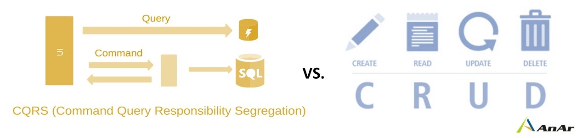

# Command Query Responsibility Segregation (CQRS)

CQRS'yi anlatmadan önce, temelini oluşturan CQS (Command Query Separation) prensibine değinmemiz gerekir.

CQS, bir metodun iki farklı rolden yalnızca birini üstlenmesi gerektiğini savunan bir tasarım prensibidir. Buna göre bir metot ya bir işlem gerçekleştirerek sistemin durumunu değiştirmeli ya da bir sorgu gerçekleştirerek mevcut bilgiyi geri döndürmelidir.

Bu iki rol:
- **Command:** İlgili sistemin durumunda değişiklik yapar. Örneğin yeni veri eklemek veya var olan veri üzerinde güncelleme yapmak için kullanılır (Insert, Update, Delete).
````markdown
```csharp
using CQRS.Data;
using CQRS.Models;

namespace CQRS.Commands
{
    public class UpdateOrderCommandHandler
    {
        public Order Handle(UpdateOrderCommand command)
        {
            var order = Database.Orders.Find(
                order => order.Id == command.Id
            );

            if (order == null)
            {
                return null;
            }

            order.Product = command.Product;
            order.Quantity = command.Quantity;

            return order;
        }
    }
}
````

Bu kodda `UpdateOrderCommandHandler`, `UpdateOrderCommand` içerisindeki `Id` değerine göre ilgili siparişi bulur. Sipariş bulunursa `Product` ve `Quantity` değerlerini günceller. **Veritabanındaki mevcut veriyi değiştirdiği için Command işlemini gerçekleştirir.**

- **Query:** İlgili sistemin mevcut durumunu değiştirmeden bilgi almak için kullanılan işlemdir. Genellikle veritabanı veya başka bir veri kaynağından bilgi döndürür.
```csharp
using System;
using System.Collections.Generic;
using CQRS.Data;
using CQRS.Models;

namespace CQRS.Queries
{
    public class GetOrderQueryHandler
    {
        public Order Handle(GetOrderQuery query)
        {
            return Database.Orders.Find(
                order => order.Id == query.Id
            );
        }
    }
}
```
---

[](https://sefikcankanber.medium.com/cqrs-command-query-responsibility-segregation-nedir-16b196376389)
*Görsel Kaynağı: [Şefik Can Kanber (Medium)](https://sefikcankanber.medium.com/cqrs-command-query-responsibility-segregation-nedir-16b196376389)*

CQRS ise Query ve Command görevlerini birbirinden ayırmayı amaçlayan bir mimari tasarım modelidir. 

Bu ayrım sayesinde özellikle büyük ve karmaşık uygulamalarda okuma ve yazma işlemlerinin birbirinden bağımsız olarak ölçeklendirilmesi ve her iki işlem türü için farklı veri modelleri veya veri erişim yöntemlerinin kullanılabilmesi mümkün hale gelir. Bu da uygun senaryolarda uygulamanın performansını ve ölçeklenebilirliğini iyileştirmeye yardımcı olur.

CQRS'nin önemli avantajlarından biri de okuma işlemlerinin ihtiyaç duyduğu verinin, yazma işlemlerinde kullanılan modelden bağımsız olarak tasarlanabilmesidir. Örneğin yalnızca birkaç alana ihtiyaç duyulan bir okuma işleminde, veritabanındaki tüm kayıtların ORM aracılığıyla OOP nesnelerine dönüştürülmesi yerine yalnızca gerekli alanların alınması sağlanabilir. Böylece gereksiz veri aktarımı, nesne oluşturma, bellek ve işlem maliyetleri azaltılabilir.

Bu nedenlerden ötürü karmaşık ve büyük ölçekli sistemlerde okuma ve yazma işlemlerinin tek bir model üzerinden yürütülmesi; performans, ölçeklenebilirlik ve esneklik açısından ciddi darboğazlar yaratır. Bu nedenle CQRS (Command Query Responsibility Segregation) mimarisi tercih edilir.

## CQRS ve Geleneksel CRUD Yaklaşımları Arasındaki Farklar

| Geleneksel CRUD | CQRS |
|---|---|
| Create, Read, Update ve Delete işlemleri genellikle aynı model ve veri erişim yapısı üzerinden gerçekleştirilir. | Okuma (Query) ve yazma/değiştirme (Command) işlemleri birbirinden ayrılır. |
| Okuma işlemleri genellikle yazma işlemlerinde kullanılan model üzerinden gerçekleştirilir. | Okuma işlemleri için ihtiyaca özel Read Model veya Projection kullanılabilir. |
| Okuma ve yazma işlemleri çoğunlukla aynı veri modelini kullanır. | Okuma ve yazma işlemleri için farklı modeller kullanılabilir. |
| Genellikle tek bir veritabanı ve ortak veri modeli kullanılır. | Aynı veritabanı kullanılabileceği gibi, ihtiyaç halinde okuma ve yazma için farklı veritabanları da kullanılabilir. |
| Okuma ve yazma işlemlerinde aynı ORM modelleri kullanılabilir. | Query tarafında ORM yerine Projection, özel Read Model veya doğrudan SQL gibi farklı yaklaşımlar tercih edilebilir. |
| Basit ve orta ölçekli uygulamalarda yeterli performans sağlar. | Okuma ve yazma işlemleri bağımsız optimize edilebildiği için uygun senaryolarda performans avantajı sağlayabilir. |
| Uygulaması ve bakımı daha basittir. | Ek modeller, Handler'lar ve veri akışları nedeniyle daha karmaşık olabilir. |
| Geliştirme maliyeti daha düşüktür ve daha hızlı uygulanabilir. | Mimari yapı daha karmaşık olduğu için geliştirme ve bakım maliyeti daha yüksek olabilir. |

[](https://anarsolutions.com/microservices-development-patterns-crud-vs-cqrs/)

## CQRS Avantajları
- Yazma işlemleri için normalleştirilmiş, okuma işlemleri için denormalize edilmiş yapılar tercih edilebilir.
- Okuma modelinde Cache ve Materialized View gibi teknikler kullanılarak sorgu performansı artırılabilir. Cache, sık kullanılan verilerin hızlı bir şekilde erişilebilmesi için saklanmasını sağlarken, Materialized View karmaşık sorguların önceden hesaplanmış sonuçlarını fiziksel olarak saklayarak sorguların tekrar tekrar hesaplanmasını önleyebilir.
- Command ve Query tarafları, yatay ölçeklendirme sayesinde farklı sunucularda veya veri merkezlerinde çalıştırılabilir. Böylece okuma ve yazma yükleri birbirinden bağımsız olarak ölçeklendirilebilir ve sistem yükünün dengelenmesine yardımcı olunabilir.
- Yoğun okuma trafiğine sahip sistemlerde, okuma işlemlerini desteklemek amacıyla veritabanı replikaları (Read Replica) kullanılabilir. Böylece Query tarafındaki okuma işlemleri ana veritabanı yerine replikalara yönlendirilerek ana veritabanının üzerindeki okuma yükü azaltılabilir.
```text
               Uygulama
                │
        ┌───────┴───────┐
        ↓               ↓
     Command          Query
     (Yazma)           (Okuma)
        │               │
        ↓               ↓
   Primary DB       Replica DB 
  ```
  
  - Replica Nedir?
    Replica, ana veritabanındaki verilerin bir kopyasının tutulduğu ayrı bir veritabanı sunucusudur. Ana veritabanı Primary/Main Database olarak düşünülebilirken, bu verinin kopyalarını tutan veritabanları Replica olarak adlandırılır.
    
    Örneğin yoğun okuma trafiğine sahip bir sistemde yapı şu şekilde olabilir:

    [](https://bytebytego.com/guides/read-replica-pattern/)
    *Görsel Kaynağı: [ByteByteGo - Read Replica Pattern](https://bytebytego.com/guides/read-replica-pattern/)*
  
    Ana veritabanında gerçekleştirilen **INSERT, UPDATE veya DELETE** gibi değişiklikler replikalara da aktarılır. Ancak bu aktarım her zaman tamamen eş zamanlı gerçekleşmeyebilir. Ana veritabanındaki değişikliğin replikalara ulaşmasında kısa bir gecikme oluşabilir.

    Örneğin ana veritabanında bir kullanıcının **sipariş detayında** değişiklik yapıldıktan hemen sonra bir Query işlemi Replica 1'e gönderilirse, Replica 1 henüz güncellenmemişse eski sipariş bilgisi döndürebilir.

    ```text
    Primary Database
           │
           │ UPDATE
           ↓
       Yeni veri
           │
           ├──────────────→ Replica 1
           │                  │
           │                  └── Henüz güncellenmediyse eski veri
           │
           └──────────────→ Replica 2
                              │
                              └── Henüz güncellenmediyse eski veri
    ```
    
    Ana veritabanındaki değişikliğin replikalara zaman içinde yansıması ve sistemin sonunda aynı duruma gelmesi Eventual Consistency (Nihai Tutarlılık) olarak ifade edilir.

    Bu nedenle replikalar kullanıldığında, bazı sistemlerde çok kısa süreliğine farklı verilerin okunabilmesi mümkündür.

- Domain-Driven Design (DDD) ile birlikte kullanılabilir. Özellikle karmaşık iş kurallarının bulunduğu sistemlerde, Command ve Query sorumluluklarının ayrılması domain modelinin ve uygulama akışının daha düzenli yapılandırılmasına yardımcı olabilir.
- Query ve Command tarafları birbirlerinden ayrıldığı için farklı kimlik doğrulama (authentication) ve yetkilendirme (authorization) politikalarının uygulanması kolaylaşabilir. Örneğin CREATE, UPDATE ve DELETE işlemleri yalnızca belirli rollere açıkken, bazı READ işlemleri daha geniş bir kullanıcı grubuna sunulabilir.
- CQRS, Event Sourcing ile birlikte kullanılabilir. Event Sourcing kullanılan sistemlerde gerçekleştirilen değişiklikler olaylar (Event) olarak saklanarak sistemin geçmiş durumunun yeniden oluşturulmasına olanak sağlayabilir.

## CQRS'in Dezavantajları
- Büyük sistemlerde hem command hem de query modellerinin geliştirilmesi ve bakımı ekstra iş yükü getirir.
- Küçük sistemlerde, yani basit CRUD operasyonlarının yeterli olduğu projelerde, CQRS ek bir karmaşıklık katmanı olarak algılanabilir.
- CQRS, klasik CRUD'dan daha fazla kavram ve farklı bir düşünme biçimi gerektirdiği için geliştiricinin sisteme ve kullanılan desenlere alışması zaman alabilir.

---

# Mediator


Mediator, çok sayıda nesnenin bulunduğu sistemlerde nesnelerin birbirleriyle doğrudan iletişim kurmasını azaltmak ve aralarındaki bağımlılığı en aza indirmek amacıyla kullanılan bir davranışsal (Behavioral) tasarım desenidir.

Mediator, nesneler arasındaki iletişimi doğrudan gerçekleştirmek yerine merkezi bir arabulucu nesne üzerinden yönetir. Böylece nesnelerin birbirleriyle doğrudan bağlantı kurmasına gerek kalmaz.

Nesnelerin birbirleriyle doğrudan iletişim kurması durumunda, bir nesnenin iletişim kurduğu diğer nesneye referans vermesi veya onu doğrudan tanıması gerekebilir. Nesne sayısı ve aralarındaki iletişim arttıkça bu doğrudan bağlantılar zamanla karmaşık bir yapı oluşturabilir. Bu durum, nesneler arasında sıkı bağlı (tightly coupled) bir tasarımın oluşmasına ve sistemin esnekliğinin azalmasına neden olabilir.

Sistem büyüdükçe nesneler arasındaki bağlantıların karmaşıklığının artması; sistemin yönetilmesini zorlaştırabilir, bakım maliyetlerini ve geliştirme süresini artırabilir. Ayrıca bir nesnede yapılan değişikliklerin diğer nesneler üzerindeki etkisini artırarak değişikliklerin beraberinde getirdiği riskleri yükseltebilir.

Mediator kullanıldığında ise nesneler, iletişim kurmak istedikleri diğer nesnelerin referanslarını doğrudan barındırmak yerine Mediator üzerinden iletişim kurarlar. Böylece nesneler arasındaki iletişim merkezi bir yapı üzerinden yönetilir.

Örneğin normal bir yapıda A sınıfı B ile, B sınıfı C ile ve C sınıfı D ile doğrudan iletişim kurabilir. Nesne sayısı arttıkça bu ilişkiler daha karmaşık hale gelebilir.

Mediator kullanıldığında ise:


Nesneler iletişim kurmak istediklerinde doğrudan birbirlerine başvurmak yerine Mediator'a başvurur. Mediator ise gelen iletişimi ilgili nesneye yönlendirir.

## Avantajları

* Nesneler arasındaki doğrudan bağımlılıkları azaltır. Nesneler arasındaki daha az bağımlılık, bu nesnelerin farklı yerlerde kullanılmasını kolaylaştırabilir.
* Sınıflar arasındaki iletişimi daha merkezi ve düzenli hale getirir.
* Nesnelerin birbirlerinin iç yapısını ve iletişim detaylarını bilme ihtiyacını azaltır.
* Karmaşık nesne iletişimlerinin yönetilmesini kolaylaştırabilir.
* Kodun bakımının yapılmasını kolaylaştırabilir.
* Bir sınıfta yapılan değişikliğin diğer sınıflar üzerindeki etkisini azaltabilir.
* İstemci sınıfının kendi sorumluluğuna odaklanmasına yardımcı olur. İstemcinin diğer nesneleri doğrudan çağırması için gereken kodlamaları ve referansları azaltabilir.
* Open/Closed Principle'a uyumu destekleyebilir. Mediator'a yeni iletişim senaryolarının eklenmesi, mevcut kodlarda değişiklik yapma ihtiyacını azaltabilir.

## Dezavanatjları
- Sistem büyüdükçe mediator her şeyi yapan, aşırı büyümüş bir sınıfa "God Class" dönüşebilir.
- Doğrudan çağrının yeterli olduğu basit sistemlerde Mediator ve Handler gibi ek katmanlar debugging (hata ayıklama) sürecini zorlaştırabilir.
- Çok sayıda Command, Query ve Handler oluşturulması, özellikle küçük projelerde gereksiz karmaşıklığa neden olabilir.

## Kaynakça

1. Şefik Can Kanber, "CQRS (Command Query Responsibility Segregation) Nedir?", Medium.  
   https://sefikcankanber.medium.com/cqrs-command-query-responsibility-segregation-nedir-16b196376389

2. Emre Can Ayar, "CQRS (Command Query Responsibility Segregation) Nedir?", 22 Ocak 2024.  
   https://emrecanayar.wordpress.com/2024/01/22/cqrs-command-query-responsibility-segregation-nedir/

3. Mrasitesdemir7, "Command Query Separation (CQS)", Medium.  
   https://medium.com/@mrasitesdemir7/command-query-separation-cqs-ff6d65925c0b

4. Ylcnfrht, "CQRS (Command Query Responsibility Segregation) – Mimari, Detaylar, Avantajlar, Dezavantajlar ve ...", Medium.  
   https://medium.com/@ylcnfrht/cqrs-command-query-responsibility-segregation-mimari-detaylar-avantajlar-dezavantajlar-ve-f7b6f3ae08e8

5. Kodcular, "Mediator Design Pattern Nedir?", Medium.  
   https://medium.com/kodcular/mediator-design-pattern-nedir-20585adf0e98

6. Bilişim Hareketi, "Mediator Tasarım Kalıbı", Medium.  
   https://medium.com/bili%C5%9Fim-hareketi/mediator-tasar%C4%B1m-kal%C4%B1b%C4%B1-881ee987ea72
