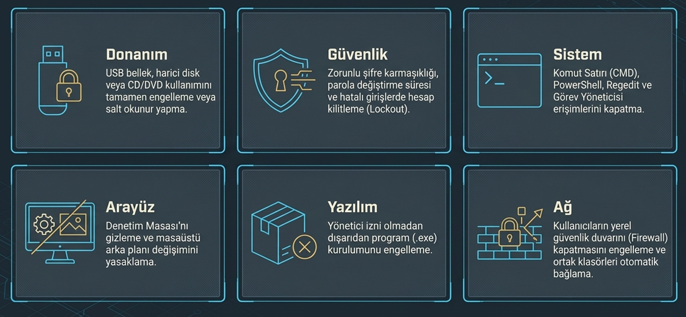

# Merkezi Kimlik Yönetimi: Active Directory, LDAP ve Kerberos

## İçindekiler

- [Giriş](#giriş)
- [1. Neden Merkezi Kimlik Yönetimi Gerekli?](#1-neden-merkezi-kimlik-yönetimi-gerekli)
- [2. Active Directory (AD)](#2-active-directory-ad)
  - [2.1 Active Directory Nedir?](#21-active-directory-nedir)
  - [2.2 Veritabanı: ntds.dit](#22-veritabanı-ntdsdit)
  - [2.3 Workgroup ile Farkı](#23-workgroup-ile-farkı)
  - [2.4 Özellikler](#24-özellikler)
  - [2.5 Group Policy (GPO)](#25-group-policy-gpo)
  - [2.6 Active Directory Rolleri (FSMO Rolleri)](#26-active-directory-rolleri-fsmo-rolleri)
  - [2.7 Authentication ve Authorization](#27-authentication-ve-authorization)
  - [2.8 Active Directory'nin Desteklediği Teknolojiler](#28-active-directorynin-desteklediği-teknolojiler)
  - [2.9 Avantajları](#29-avantajları)
  - [2.10 Dezavantajları](#210-dezavantajları)
- [3. LDAP (Lightweight Directory Access Protocol)](#3-ldap-lightweight-directory-access-protocol)
  - [3.1 LDAP Nedir?](#31-ldap-nedir)
  - [3.2 Dizinde Tutulan Veri Türleri](#32-dizinde-tutulan-veri-türleri)
  - [3.3 LDAP Nasıl Çalışır?](#33-ldap-nasıl-çalışır)
  - [3.4 LDAP'ta Kimlik Doğrulama: Bind](#34-ldapta-kimlik-doğrulama-bind)
  - [3.5 LDAP'ın Avantajları](#35-ldapın-avantajları)
  - [3.6 LDAP'ın Dezavantajları](#36-ldapın-dezavantajları)
- [4. Kerberos](#4-kerberos)
  - [4.1 Kerberos Nedir?](#41-kerberos-nedir)
  - [4.2 Temel Terimler](#42-temel-terimler)
  - [4.3 Kerberos Kimlik Doğrulama Süreci Nasıl Çalışır?](#43-kerberos-kimlik-doğrulama-süreci-nasıl-çalışır)
  - [4.4 Kullanım Yerleri](#44-kullanım-yerleri)
  - [4.5 Avantajları](#45-avantajları)
  - [4.6 Dezavantajları ve Zayıf Noktaları](#46-dezavantajları-ve-zayıf-noktaları)
- [Kaynaklar](#kaynaklar)

---

## Giriş

Geleneksel olarak kullanıcılar bilgisayar sistemlerine erişirken bir parola girer. Bu yöntemin en büyük zorluğu şudur: Bilgisayar korsanları parolayı ele geçirirse kullanıcının kimliğine bürünebilir ve kuruluşun ağına erişim sağlayabilir. Kuruluşların sistemlerini ve kullanıcılarını korumak için daha iyi bir yönteme ihtiyacı vardır.

Bu dokümanda merkezi kimlik yönetiminin neden gerekli olduğunu, bu işi yapan **Active Directory**'yi, ona erişmek için kullanılan **LDAP** protokolünü ve kimlik doğrulamayı güvenli hale getiren **Kerberos**'u sırasıyla ele alacağız.

---

## 1. Neden Merkezi Kimlik Yönetimi Gerekli?

Günümüzde dağıtık sistemlerin (örneğin mikroservis mimarilerinin) hızla artması, güvenlik ve yönetim süreçlerini oldukça karmaşık hale getirmiştir. İçinde hassas veriler barındıran bu sistemlerin birbiriyle güvenlik onayı olmadan doğrudan iletişim kurması kabul edilemez. Öte yandan her sistemin kendine ait ayrı bir kimlik doğrulama prosedürü olması da süreci yönetilemez hale getirir.

Ağlar büyüdükçe sisteme sadece "kullanıcı adı ve şifre" ile giriş yapma mantığı yetersiz kalır. Kontrolü ve bütünlüğü sağlamak için sistemleri merkezi hale getirmenin temel sebepleri şunlardır:

* **Yönetilemez BT iş yükü:** Ağımızda 1000 bilgisayar ve bunların içinde çalışan onlarca sunucu/uygulama olduğunu düşünelim. Merkezi bir sistem (Directory) yoksa, işe yeni başlayan tek bir çalışan için tüm bu sistemlerde ayrı ayrı hesap açmak ya da şifre sıfırlamak BT ekibi için devasa bir iş yüküne dönüşür.
* **Personel çıkışlarındaki güvenlik açığı:** İşten ayrılan bir personelin erişimini kesmek için hesabının binlerce cihazdan tek tek silinmesi gerekir. Bu manuel işlem bitene kadar eski çalışanın sistemlere erişimi devam eder ve kurum siber tehditlere açık kalır.
* **İnce ayarlı yetkilendirme (RBAC) ihtiyacı:** Basit kimlik doğrulama mekanizmaları yalnızca *"Bu kişi sisteme girebilir mi?"* sorusuna cevap verir. Kurumsal yapılarda ise *"Bu kişi sisteme girdikten sonra sadece okuyabilir mi, yoksa dosya silebilir mi?"* gibi detaylı yetkilendirmelere (Role-Based Access Control) ihtiyaç duyulur. Ayrı ayrı yönetilen tekil cihazlar bu hiyerarşik yapıyı sunamaz.
* **Denetim ve loglama karmaşası:** Olası bir güvenlik ihlalinde *"Kim, ne zaman, nereye dokundu?"* sorusunun cevabı hemen bulunabilmelidir. Her sunucu ve bilgisayar kendi güvenliğini kendisi yönetiyorsa, yüzlerce cihazın loglarını tek tek toplayıp anlamlı bir analiz yapmak neredeyse imkansızdır.

Tüm bu sebeplerden dolayı ağ kaynaklarını ve kullanıcı kimliklerini tek bir merkezden, güvenli ve hiyerarşik bir şekilde yönetmek için **Active Directory** gibi merkezi dizin sistemlerine ihtiyaç duyulmuştur.

---

## 2. Active Directory (AD)

### 2.1 Active Directory Nedir?

Active Directory, Microsoft tarafından bu sorunları çözmek ve ağ yönetimini daha etkili hale getirmek için geliştirilmiştir. Temelleri Windows NT işletim sistemiyle atılmış, 2000'lerin başında Windows Server ile birlikte kullanıma sunulmuş ve kendini geliştirerek günümüzdeki halini almıştır.

Kısaca Active Directory'ye merkezi bir kimlik yönetim sistemi diyebiliriz. Aynı zamanda sunucu ve son kullanıcı bilgisayar nesnelerinin, kullanıcı hesaplarının ve grup bilgilerinin tutulduğu bir **dizin servisidir**. Bu dizinin içinde server, client, printer, user gibi bilgiler bulunur. Bu tür bilgileri depoladığı için veritabanlarına biraz benzetilebilir, ancak burada depolamanın yanında yönetim işlemleri de devreye girer. LDAP ile uyumludur.

Active Directory öncelikle Microsoft Windows'un bir özelliğidir, ancak diğer işletim sistemleri de sınırlı ölçüde buna katılabilir. Örneğin Linux tabanlı bir bilgisayarı bir Active Directory ortamına dahil edebilirsiniz.

### 2.2 Veritabanı: ntds.dit

Active Directory'nin veritabanı **`ntds.dit`** dosyasıdır (*New Technology Directory Services - Directory Information Tree*). Tüm sorgulama ve değişiklik işlemleri ile veritabanı yönetimi, **ESE (Extensible Storage Engine)** adlı veritabanı motoru tarafından yürütülür.

Active Directory kullanılan bir sistemde herhangi bir veri kaybı yaşamamak için `ntds.dit` dosyasının yedeğinin düzenli olarak alınması gerekir.

Bu merkezi veritabanında şunlar tutulur:

- **Kullanıcı ve bilgisayar kimlik bilgileri:** Kullanıcı adları, parolalar, e-posta adresleri ve diğer kimlik bilgileri burada korunur. Bu sayede kullanıcılar sisteme güvenli bir şekilde oturum açabilir.
- **Ağ kaynaklarının bilgileri:** Kullanıcıların ve bilgisayarların bu kaynaklara erişimi buradan düzenlenir ve izlenir.
- **E-posta hizmetleriyle ilgili veriler:** Active Directory, e-posta hizmetlerini sağlayan Exchange Server ile bütünleşir. Kullanıcıların e-posta hesapları ve iletişim bilgileri AD'de saklanır; böylece Exchange Server, AD ile koordineli çalışabilir.
- **Group Policy ayarları:** Ağdaki bilgisayarlar ve kullanıcı hesapları üzerinde merkezi olarak değişiklik yapmamızı sağlar.

### 2.3 Workgroup ile Farkı

Active Directory kullanılmayan sistemlerde, aynı ağdaki her bilgisayarın kullanıcı ve parola bilgilerini tutan kendi küçük veritabanı vardır. Microsoft bu yapıyı **Workgroup** olarak adlandırır.

Ağ küçükse Workgroup yönetilebilir, fakat bilgisayar sayısı arttıkça işler zorlaşır. Büyük ağlarda Workgroup'un tercih edilmemesinin nedenlerinden bazıları şunlardır:

- Merkezi bir yönetim yoktur. Her bilgisayarın kendi kullanıcılarını ve parolalarını yönetmesi gerekir; bu da büyük ağlarda yönetim karmaşıklığına yol açar.
- Kullanıcıların diğer bilgisayarlara erişebilmesi için her yerde aynı kullanıcı adı ve parolayı kullanması gerekir. Bu hem kullanıcı hem de yönetici için ekstra zahmettir.
- Bir kullanıcı parolasını değiştirdiğinde bu değişikliğin ağdaki diğer bilgisayarlarla da senkronize edilmesi gerekir. Aksi halde kullanıcı diğer bilgisayarlara erişirken sorun yaşar.

Active Directory bu sınırlamalara çözüm sunar. Tüm kullanıcıları ve parolalarını merkezi bir veritabanında tutar. Bir kullanıcının parolası değiştiğinde ağdaki tüm bilgisayarlar bu değişiklikten haberdar olur.

### 2.4 Özellikler

* Yönetilebilirlik
* Ölçeklenebilirlik
* Genişletilebilirlik
* Güvenlik entegrasyonu
* Diğer dizin servisleriyle birlikte çalışabilme
* Güvenli kimlik doğrulama ve yetkilendirme
* Group Policy ile yönetim
* DNS ve DHCP gibi servislerle birlikte çalışabilme

### 2.5 Group Policy (GPO)

Active Directory ile birlikte gelen Group Policy sayesinde çeşitli kısıtlamalar yapılabilir ve kullanıcılar bu kısıtlamalara dahil edilebilir. Örnekler:

Group Policy Objects (GPO) üç gruba ayrılır:

1. **Yerel Grup İlkesi (Local Group Policy):** Sadece bulunduğu bilgisayar için geçerlidir ve o bilgisayara erişen kullanıcılara gerekli ayarları uygular. Varsayılan olarak tüm Windows bilgisayarların yerel bir GPO'su vardır.
2. **Yerel Olmayan Grup İlke Objeleri (Domain GPO):** Var olan bir ilke ayarını bir veya birden fazla kullanıcıya ve bilgisayara uygulamak istediğimizde kullandığımız objedir. Yerel objeler gibi kullanıcılara ve bilgisayarlara uygulanabilir; buna ek olarak Active Directory nesnelerine (site, domain, OU) bağlanabilir.
3. **Başlangıç Grup İlke Objeleri (Starter GPO):** Grup ilke ayarları için bir şablon görevi görür. Sık kullanılan ayarları hazır tutup yeni GPO'lar oluştururken başlangıç noktası olarak kullanırız.

---

### 2.6 Active Directory Rolleri (FSMO Rolleri)

Active Directory içerisinde beş temel rol vardır ve her birinin görevi farklıdır.

  
<small>*Kaynak: (https://woshub.com/active-directory/)*</small>

1. **Domain Naming Master (Alan Adı İsim Yöneticisi):** Alan adı çakışmalarını önler ve yeni bir alan adı oluşturulurken bu adın onaylanmasını sağlar.
2. **Schema Master:** Active Directory'deki nesnelerin, yani veritabanındaki tabloların yapısını (şemasını) belirler.
3. **Relative Identifier Master (RID Master):** AD'de oluşturulan her kullanıcı, grup veya bilgisayarın benzersiz bir güvenlik numarası vardır; buna **SID (Security Identifier)** denir. SID'in, domain'i temsil eden sabit bir baş kısmı bulunur. Bu sabit numaranın sonuna eklenen ve nesneyi ağ içinde benzersiz kılan sıra numarasına **RID** denir. RID Master bu numaraların dağıtımından sorumludur.
4. **Primary Domain Controller Emulator (PDC Emulator):** En çok iş yapan roldür:
   - Bir kullanıcı şifresini değiştirdiğinde bu değişiklik anında PDC Emulator'e iletilir. Kullanıcı eski şifresiyle hatalı giriş yaparsa sistem hesabı kilitlemeden önce PDC Emulator'e *"Bu kişi az önce şifresini değiştirmiş olabilir mi, sende güncel şifre var mı?"* diye sorar. Art arda hatalı girişlerde hesabı kilitleme yetkisi de ondadır.
   - Kerberos'un çalışabilmesi için ağdaki cihazların ve sunucuların saatlerinin birbiriyle uyumlu olması gerekir (varsayılan tolerans 5 dakikadır). PDC Emulator şirket ağının ana saat kaynağıdır; diğer cihazlar saatlerini ona göre ayarlar.
   - Sistem yöneticileri yeni bir GPO kuralı yazdığında veya mevcut bir kuralı değiştirdiğinde, bu değişiklikler varsayılan olarak doğrudan PDC Emulator üzerinde yapılır ve oradan diğer sunuculara dağıtılır.
   - Eski nesil sistemler veya Kerberos desteklemeyen uygulamalar ağa bağlanmak istediğinde kimlik doğrulama işlemini PDC Emulator üstlenir.
5. **Infrastructure Master (Altyapı Yöneticisi):** Nesnelerdeki değişikliklerin güncellenmesinden ve farklı domain'ler arasındaki nesne ilişkilerinin yönetilmesinden sorumludur.

### 2.7 Authentication ve Authorization

Bu iki kavram sık karıştırılır, o yüzden ayrı ayrı bakalım:

* **Authentication (Kimlik Doğrulama):** Kullanıcıların veya cihazların kimliklerini doğrulamak için kullanılan işlemlerdir. Ancak kimliğin doğrulanmış olması, kullanıcının belirli kaynaklara erişme yetkisi olduğu anlamına gelmez. Yani kimliği doğrulanmış bir kullanıcının hangi kaynaklara erişebileceği henüz belirlenmemiştir.
* **Authorization (Yetkilendirme):** Kimlik doğrulamadan sonra bir kullanıcının veya cihazın belirli kaynaklara (dosyalar, sunucular vb.) erişim hakkının kontrol edilmesi sürecidir. Kullanıcının hangi kaynaklara erişebileceği ve ne tür işlemler yapabileceği bu aşamada belirlenir.

### 2.8 Active Directory'nin Desteklediği Teknolojiler

1. **DHCP (Dynamic Host Configuration Protocol):** Ağdaki bilgisayarlara, sunuculara ve diğer cihazlara otomatik olarak IP adresi dağıtır. Cihazların manuel ayar yapmadan ağa ve Active Directory ortamına dahil olmasını sağlar.
2. **DNS (Domain Name System):** Temel görevi IP adreslerini isimlerle eşleştirmektir. İstemcilerin (client) giriş yapacakları Domain Controller sunucusunu bulabilmesi tamamen DNS kayıtları sayesinde gerçekleşir. **DNS çökerse Active Directory de çalışamaz.**
3. **LDAP (Lightweight Directory Access Protocol):** Active Directory veritabanına erişmek, bilgi okumak, yazmak ve sorgu yapmak için kullanılan standart iletişim dilidir. Örneğin bir uygulamanın AD'ye "X kullanıcısı Muhasebe grubunda mı?" diye sorması LDAP ile olur.
4. **Kerberos:** Active Directory'nin varsayılan ve en güvenli kimlik doğrulama protokolüdür. Biletleme mantığıyla güvenli oturum açmayı sağlar.
5. **NTLM (New Technology LAN Manager):** Kerberos'tan önceki eski nesil kimlik doğrulama protokolüdür. Barındırdığı güvenlik zafiyetleri nedeniyle günümüzde öncelikli olarak tercih edilmez; yalnızca Kerberos'u desteklemeyen eski işletim sistemleri ve uygulamalarla geriye dönük uyumluluk (legacy) için yedekte tutulur.
6. **LDAPS (LDAP Secure):** LDAP protokolünün SSL/TLS sertifikalarıyla şifrelenmiş, güvenli hale getirilmiş sürümüdür. Bilgi alışverişi sırasında kullanıcı adlarının veya şifrelerin ağda düz metin olarak okunmasını ve dinlenmesini engeller.

### 2.9 Avantajları

- Yönetimi merkezileştirir ve güvenlik işlemlerini kolaylaştırır.
- Kullanıcılara grup bazında yetkilendirme veya kısıtlama yapılabilir.
- Kullanıcıların zararlı uygulama yüklemesi engellenebilir.
- Kimlik denetimi sağlayarak şirket genelinde güvenliği artırır.
- Firewall ile tam entegre çalışabilir.
- Replikasyon teknolojisi sayesinde AD veritabanı ağ ortamında farklı sunuculara aktarılabilir.

Burada geçen iki kavramı kısaca açıklayalım:

* **Firewall (Güvenlik Duvarı):** Genelde ağı korurken cihazların IP adreslerine göre kural yazar. Active Directory ile entegre olduğunda ise IP adresleri yerine doğrudan kullanıcıların kimliklerini ve gruplarını tanıyıp bunlar üzerinden yönetim yapılmasını sağlar.
* **Replication (Çoğaltma):** Active Directory veritabanının (`ntds.dit`) ağdaki birden fazla sunucu (Domain Controller) arasında sürekli olarak senkronize edilmesi, yani kopyalanması işlemidir.

### 2.10 Dezavantajları

- Active Directory'nin karmaşıklığı yanlış yapılandırmalara yol açabilir. Bu yüzden doğru kurulması ve yönetilmesi çok önemlidir.
- Eski veya ayrılmış kullanıcı hesaplarının sistemde saklanması güvenlik açıklarına neden olabilir. Bu hesaplar düzenli olarak devre dışı bırakılmalı veya silinmelidir.
- AD sunucuları ağın temelini oluşturur. Bu sunucularda yaşanan bir arıza tüm ağın çökmesine yol açabilir. Bu nedenle yedekleme ve yüksek erişilebilirlik önlemleri alınmalıdır.

---

## 3. LDAP (Lightweight Directory Access Protocol)

### 3.1 LDAP Nedir?

LDAP, uygulamaların kullanıcı bilgilerini hızlı bir şekilde sorgulamasına olanak tanıyan bir protokoldür. Şirketler kullanıcı adlarını, şifreleri, e-posta adreslerini, yazıcı bağlantılarını ve diğer statik verileri dizinlerde saklar. LDAP, bu verilere erişmek ve bunları yönetmek için kullanılan açık ve satıcıdan bağımsız bir uygulama protokolüdür.

LDAP kimlik doğrulamayı da ele alabilir. Böylece kullanıcılar yalnızca bir kez oturum açıp sunucudaki birçok farklı kaynağa erişebilir. Yani bir sayfadan her ayrıldıklarında tekrar oturum açmak yerine, o gün için tek seferlik giriş yapmaları yeterli olur.

<small>Kaynak: https://www.okta.com/identity-101/what-is-ldap/</small>

LDAP bir protokol olduğu için dizin programlarının nasıl çalışacağını belirlemez. Bunun yerine, kullanıcıların ihtiyaç duydukları bilgilere çok hızlı ulaşmasını sağlayan bir dil biçimidir. Bu yüzden sadece Microsoft Active Directory ile değil; Linux tabanlı OpenLDAP, Apple Open Directory veya Novell gibi birçok farklı dizin programıyla da sorunsuz çalışabilir.

> **LDAP ve Active Directory ilişkisi:** LDAP, Active Directory'yi okuyabilen bir protokoldür. Bu nedenle ikisi kullanıcılara yardımcı olmak için birlikte çalışır. Ancak birbirleriyle rekabet etmezler ve tam olarak aynı şeyi yapmazlar: Active Directory dizin servisinin kendisidir, LDAP ise ona erişmek için kullanılan dildir.

### 3.2 Dizinde Tutulan Veri Türleri

Bir dizinin içerdiği veriler genel olarak üç özelliğe sahiptir:

- **Descriptive (Tanımlayıcı):** Bir kimlik kartı gibi düşünebiliriz. İsim, e-posta adresi, ofis, departman, telefon numarası gibi birden fazla bilgi bir araya gelerek o varlığı (kullanıcıyı veya cihazı) tanımlar.
- **Static (Statik):** Veriler sürekli değişmez, değiştiğinde de değişiklikler küçük ve nadirdir. Örneğin bir çalışanın adı, departmanı veya pozisyonu her gün değişmez.
- **Valuable (Değerli):** Bu statik bilgiler temel iş fonksiyonları için kritiktir ve sürekli olarak okunur. Örneğin bir çalışan günde 10 farklı sisteme girdiğinde, bu sistemler saniyeler içinde defalarca LDAP'a *"Bu kişi doğru kişi mi?"* diye sorar.

### 3.3 LDAP Nasıl Çalışır?

#### Temel Bileşenler

- **LDAP Sunucusu (Directory System Agent - DSA):** Dizin hizmetini barındırır ve verileri **Directory Information Tree (DIT)** adı verilen hiyerarşik bir yapıda saklar. DIT; kullanıcılar, gruplar veya cihazlar gibi nesneleri temsil eden girişlerden oluşur. Her giriş, **Distinguished Name (DN)** ile benzersiz şekilde tanımlanır ve nesneyi tarif eden öznitelikler (attribute) içerir.
- **LDAP İstemcisi:** Dizin girdilerini aramak, değiştirmek veya yönetmek için LDAP sunucusuna bağlanan uygulama ya da sistemdir.

#### Tipik Bir LDAP Sorgusu

1. İstemci, standart bir port (varsayılan olarak TCP 389 veya güvenli LDAPS için 636) üzerinden Active Directory sunucusuna ağ bağlantısı kurar.
2. İstemci, dizine erişim yetkisi kazanmak için sunucuya kimlik doğrulama isteği (LDAP Bind) gönderir.
3. İstemci; arama başlangıç noktasını (Base DN), arama kapsamını ve aranan öznitelik kriterlerini (örneğin e-posta adresi arayan bir Search Filter) belirterek sorgu talebini sunucuya iletir.
4. Active Directory, hiyerarşik dizin veritabanında kriterlere uyan nesneleri arar ve elde ettiği sonuçları istemciye döner.
5. İstemci, sunucuya oturumu sonlandırma isteği (LDAP Unbind) göndererek bağlantıyı kapatır.

#### Yapılabilecek İşlemler

LDAP ile dizin üzerinde şu işlemler yapılabilir:

- Dizine yeni bir giriş (entry) eklemek
- Dizinden bir girişi silmek
- Dizinde bir şey bulmak için sorgu başlatmak
- İki girişi benzerlik veya farklılık açısından karşılaştırmak
- Mevcut bir girişi değiştirmek

### 3.4 LDAP'ta Kimlik Doğrulama: Bind

LDAP dünyasında kimlik doğrulama (oturum açma) işlemine teknik olarak **"Bind" (Bağlanma)** denir. Bir uygulama veya kullanıcı, dizinde arama yapmadan önce sunucuya bir **Bind Request** gönderir. LDAP bu doğrulamayı temel olarak 3 farklı yöntemle yapar:

**1. Basit Kimlik Doğrulama (Simple Bind)**
İstemci sunucuya kullanıcı adını (Distinguished Name - DN) ve parolasını gönderir. Normal LDAP (Port 389) kullanılırsa bu parola ağda düz metin (okunabilir) olarak gider. Bu yüzden bu yöntemin her zaman SSL/TLS ile şifrelenmiş **LDAPS (Port 636)** üzerinden yapılması gerekir.

**2. SASL (Gelişmiş) Kimlik Doğrulama**
LDAP, kullanıcının parolasını düz metin olarak almak yerine daha güvenli dış mekanizmalara güvenir. Örneğin **Kerberos**. Active Directory ortamlarındaki en güvenli ve modern standart budur.

**3. Anonim Bağlantı (Anonymous Bind)**
Kullanıcı adı veya parola istenmez, sistem herkese açıktır. Çok büyük bir güvenlik zafiyeti (bilgi sızdırma) yaratacağı için günümüz kurumsal ağlarında ve Active Directory yapılarında bu yöntem varsayılan olarak kapalıdır.

### 3.5 LDAP'ın Avantajları

- **Merkezi yönetim:** Kullanıcı hesapları, gruplar, cihazlar ve diğer nesneler gibi dizin bilgileri merkezi olarak yönetilir. Bu da yöneticilerin kurum genelinde tutarlılığı ve kontrolü sağlamasını kolaylaştırır.
- **Ölçeklenebilirlik:** Büyük hacimli verileri ve çok sayıda okuma işlemini verimli şekilde işlemek üzere tasarlanmıştır. İşletmenin ihtiyaçlarıyla birlikte büyüyebildiği için küçük işletmelerden büyük işletmelere kadar her ölçekte kullanılabilir.
- **Esneklik:** Çok çeşitli veri türlerini ve yapılarını destekler. İşletmeler dizin hizmetlerini kendi özel gereksinimlerine göre özelleştirebilir. Bu esneklik LDAP'ın farklı uygulama ve sistemlerle entegre edilmesini de kolaylaştırır.
- **Geliştirilmiş güvenlik:** Kimlik doğrulama ve yetkilendirmeyi merkezileştirerek güvenliği artırır. İşletmeler LDAP ile tek oturum açma (SSO) sistemi uygulayarak yetkisiz erişim riskini azaltabilir.
- **Azaltılmış karmaşıklık:** Hiyerarşik yapısı olan Directory Information Tree (DIT), verilerin düzenlenmesini basitleştirir; kullanıcıların ve uygulamaların bilgiyi bulmasını kolaylaştırır.

### 3.6 LDAP'ın Dezavantajları

- **Yazma performansı:** LDAP, dizin hizmetlerinde daha yaygın olan okuma işlemleri için optimize edilmiştir. Bu yüzden özellikle sık güncelleme yapılan büyük ortamlarda yazma işlemleri yavaşlayabilir.
- **Karmaşıklık:** Esnek ve ölçeklenebilir olsa da hiyerarşik yapısı ve şeması, özellikle protokole aşina olmayan yöneticiler için kurulumu ve bakımı zorlaştırabilir.
- **Sınırlı işlem (transaction) desteği:** LDAP, işlemleri ilişkisel veritabanları gibi yerel olarak desteklemez. Birden fazla ilişkili güncelleme yaparken veri tutarlılığını sağlamak zorlaşabilir.
- **Yerleşik veri şifrelemesinin olmaması:** LDAP, sunucuda depolanan veriler için yerleşik şifreleme sağlamaz. Bu sınırlama, istemci ile sunucu arasındaki iletişimi SSL/TLS (LDAPS) ile güvenceye alarak ve hassas veriler için başka şifreleme yöntemleri kullanarak hafifletilebilir.
- **Sınırlı sorgu yetenekleri:** Arama işlevi, ilişkisel veritabanlarındaki SQL sorguları kadar güçlü ve esnek değildir. Karmaşık aramalar veya birden fazla koşula bağlı veri çekme işlemleri zorlaşabilir.
- **Tek arıza noktası:** Tek sunuculu bir LDAP yapılandırmasında sunucu tek hata noktası haline gelebilir. İşletmeler bunu çözmek için çoklu ana çoğaltma (multi-master replication) veya diğer yüksek erişilebilirlik stratejilerini uygulayabilir.

---

## 4. Kerberos

### 4.1 Kerberos Nedir?

Kerberos, ağ güvenliğini sağlamak amacıyla Massachusetts Teknoloji Enstitüsü (MIT) tarafından Athena Projesi için geliştirilmiş bir kimlik doğrulama protokolüdür. Ağ üzerinden parola göndermeden, biletleme mantığıyla kimlik doğrulamayı mümkün kılar.

Adını, Yunan mitolojisinde yeraltı tanrısı Hades'in üç başlı bekçi köpeği **Cerberus**'tan alır. Mitolojide Cerberus'un görevi ölüler diyarı ile yaşayanlar dünyası arasındaki sınırı korumak ve izinsiz giriş çıkışları engellemekti. Kerberos da ağ üzerindeki yetkisiz girişleri engellemek için benzer bir bekçi görevi üstlenir.

Protokolün güncel sürümü (**Kerberos V5**), iletişimi güvence altına almak ve veri ihlallerini önlemek için Gelişmiş Şifreleme Standardı (**AES**) gibi güçlü şifreleme algoritmalarını destekler.

### 4.2 Temel Terimler

* **Kerberos Realm (Kerberos Etki Alanı):** Kapalı bir şirket ağındaki yetki bölgesi olarak düşünülebilir. Kerberos'un belirli servislere veya uygulamalara erişim için kullanıcı kimliğini doğrulayabildiği sistem sınırıdır. Bu alanda bulunan her varlığın ait olduğu yer DNS adı ile tanımlanır.
* **Application Server (Uygulama Sunucusu):** Kerberos etki alanı içinde dosyalara veya servislere erişmek isteyen istemcilerden kimlik doğrulaması şart koşan sistemlerdir.
* **Client (İstemci):** Bir sisteme veya servise erişmek isteyen kullanıcıyı ya da bu kullanıcının kullandığı cihazı/uygulamayı ifade eder.

* **Principals (Kimlikler / Özneler):** Kerberos ağı içinde birbirleriyle iletişim kuran ve sistemde benzersiz ID'lerle ayırt edilen kişi veya servislerdir. İki ana türü vardır:
  * **Service Principal Name (SPN - Servis Asıl Adı):** Belirli bir etki alanındaki bir servis veya uygulama için kullanılan benzersiz kimliktir.
  * **User Principal Name (UPN - Kullanıcı Asıl Adı):** Belirli bir etki alanındaki bir kullanıcı için kullanılan benzersiz kimliktir.

* **Key Distribution Center - KDC (Anahtar Dağıtım Merkezi):** Kullanıcıların kimliklerini doğrulayan ve şifreleme anahtarlarını dağıtan "güvenilir üçüncü taraf" mekanizmasıdır. Genellikle Active Directory gibi bir Domain Controller üzerinde çalışır. Kendi içinde iki ayrı birime ayrılır:
  * **Authentication Server (AS - Kimlik Doğrulama Sunucusu):** Sisteme giriş yapan kullanıcının kimliğini kontrol eden ve doğrulama başarılı olursa ona sistemde dolaşabilmesi için ana bilet olan TGT'yi veren birimdir.
  * **Ticket Granting Service (TGS - Bilet Veren Sunucu):** TGT'ye sahip bir kullanıcı ağdaki başka bir servise gitmek istediğinde ona o servise özel bir bilet (ST) veren birimdir.

* **Ticket Granting Ticket (TGT - Bilet Alma Bileti):** Kullanıcı sisteme ilk giriş yaptığında AS tarafından verilen "ana giriş kartı"dır. İstemci kimliği, IP adresi, oturum anahtarı, zaman damgası ve biletin geçerlilik süresi (TTL) gibi kritik bilgileri barındırır. Bu bilet KDC'nin kendi gizli anahtarı ile şifrelenir; bu sayede kullanıcı biletin içeriğini okuyamaz veya değiştiremez.

* **Service Ticket (ST - Servis Bileti):** TGT kullanılarak TGS'den alınan ve kullanıcının erişmek istediği spesifik servise giriş yapmasını sağlayan alt bilettir.
* **Authenticator Message (Doğrulayıcı Mesaj):** İstemcinin bir servise erişmek için biletini sunarken gönderdiği ek doğrulama mesajıdır. Biletin o an gerçek sahibi tarafından kullanıldığını kanıtlamak için içinde kullanıcının kimliğini ve işlemin yapıldığı anı gösteren zaman damgasını (timestamp) barındırır.

> 💡 **Çalışma mantığı ile ilgili not**
>
> Bu yapıyı iki aşamalı bir güvenlik kontrolü gibi düşünebiliriz. Sisteme ilk adım attığımızda öncelikle AS'den ağ içinde güvenilir olduğumuzu kanıtlayan *genel bir bilet (TGT)* alırız. Daha sonra ağdaki belirli bir uygulamaya erişmek istediğimizde bu genel izin belgemizi TGS'ye sunarak sadece o hedefe özel bir *erişim bileti (ST)* talep ederiz. Bu katmanlı mekanizma her adımda yetki kontrolü sağlayarak sistemi çok daha güvenli hale getirir.

<small>Kaynak: https://www.researchgate.net/figure/Kerberos-Authentication-Architecture_fig1_2489765</small>

### 4.3 Kerberos Kimlik Doğrulama Süreci Nasıl Çalışır?

Kerberos süreci temel olarak üç aşamadan oluşur:

<small>Kaynak: https://www.upguard.com/blog/kerberos-authentication</small>

#### 1. Aşama: Kimlik Doğrulama Sunucusu (AS) ile İletişim
1. İstemci, Kimlik Doğrulama Sunucusuna (AS) kendi kullanıcı adını içeren düz metin bir giriş isteği gönderir. (Parola bu adımda ağa gönderilmez.)
2. AS, veritabanında kullanıcının var olup olmadığını kontrol eder. Kullanıcı geçerliyse kullanıcının parolasının özetinden (hash) bir anahtar türetir.
3. AS, istemciye iki mesaj gönderir: Biri KDC'nin gizli anahtarıyla şifrelenmiş **TGT**, diğeri ise kullanıcının kendi parolasından türetilen anahtarla çözebileceği bir **Oturum Anahtarı (Session Key)**.
4. İstemci kendi parolasını girerek oturum anahtarını çözer ve sistemde güvenilir bir varlık olduğunu kanıtlar.

#### 2. Aşama: Bilet Veren Sunucu (TGS) ile İletişim
5. İstemci ağdaki belirli bir servise (örneğin bir dosya sunucusuna) erişmek istediğinde elindeki TGT'yi ve o an oluşturduğu Doğrulayıcı Mesajı (Authenticator) TGS'ye gönderir.
6. TGS, TGT'yi çözer ve içindeki bilgilerle Doğrulayıcı Mesajı karşılaştırır. Kimlik ve zaman damgası eşleşiyorsa işlem onaylanır.
7. TGS, istemciye o spesifik servis için kullanabileceği yeni bir **Servis Bileti (ST)** gönderir.

#### 3. Aşama: Uygulama Sunucusu ile İletişim
8. İstemci, TGS'den aldığı ST'yi ve yeni oluşturduğu bir Doğrulayıcı Mesajı doğrudan hedef Uygulama Sunucusuna gönderir.
9. Uygulama Sunucusu bileti çözer ve doğrulama işlemlerini gerçekleştirir. Başarılı olursa istemcinin servise erişimine izin verir. Karşılıklı kimlik doğrulama isteniyorsa sunucu da istemciye bir onay mesajı döndürebilir.

> **Önemli kural:** Kerberos'ta parolalar ağ üzerinden asla düz metin olarak paylaşılmaz; her adımda biletler ve geçici oturum anahtarları konuşur.

### 4.4 Kullanım Yerleri

### 4.5 Avantajları

* **Tekli Oturum Açma (SSO):** Kullanıcıların tek bir oturum açma işlemiyle yetkili oldukları tüm hizmetlere erişmesini sağlar. Tekrar tekrar giriş yapmaya gerek kalmaz; bir kez giriş yapmak, gün boyu yetkili olunan her yere doğrudan erişmek için yeterlidir. Her uygulamaya girerken parola yazılmadığı ve asıl parola ağ üzerinden gönderilmediği için parolanın ele geçirilme riski de azalır.
* **Siber güvenlik:** Güçlü şifreleme, kriptografi ve güvenilir üçüncü taraf yetkilendirmesi kullanması, siber saldırıları önlemek için veri güvenliğini güçlendirir.
* **Karşılıklı kimlik doğrulama:** Hem kullanıcının hem de hizmetin birbirini doğrulamasına olanak tanır; böylece iki tarafın da gerçek olduğundan emin olunur.
* **Erişim kontrolü:** Erişim izinleri verilmeden önce güvenlik politikalarının karşılandığından emin olmak için kimlik doğrulama yapar ve erişim kontrolünü kolaylaştırır.

### 4.6 Dezavantajları ve Zayıf Noktaları

* **Yaygın bir saldırı vektörü olması:** Protokolün uzun süredir var olması ve çok yaygın kullanılması, onu siber suçlular için popüler ve bilindik bir hedef haline getirir.
* **Sürekli izleme zorunluluğu:** Kusursuz bir yapıya sahip olmadığı için kuruluşların saldırı yüzeylerini sürekli izlemesi ve yönetmesi gerekir.
* **Zayıf şifreleme riskleri:** Sistemde RC4-HMAC gibi eski ve güvensiz şifreleme paketleri aktif kalırsa ağ trafiğinin dışarıdan dinlenmesi tehlikesi ortaya çıkar.
* **Yazılım zafiyetlerine açıklık:** Sıfır gün (zero-day) açıkları gibi yazılım hataları barındırabilir. Siber suçlular bu zafiyetleri kullanarak sisteme kötü amaçlı yazılım bulaştırabilir veya veri ihlallerine neden olabilir.
* **Kullanıcı parolalarına doğrudan bağımlılık:** Güvenlik bariyeri büyük oranda kullanıcıların belirlediği parolalara dayanır. İsim veya doğum tarihi gibi tahmin edilebilir parolalar kullanıldığında sistem veri ihlallerine açık hale gelir.
* **İç tehditlere karşı hassasiyet:** Kullanıcılara gereğinden fazla erişim hakkı verildiğinde (en az ayrıcalık ilkesi uygulanmadığında) şirket içinden gelebilecek tehditlere karşı ciddi bir güvenlik riski oluşur.

---

## Kaynaklar

- https://www.upguard.com/blog/kerberos-authentication
- https://www.fortinet.com/resources/cyberglossary/kerberos-authentication
- https://medium.com/@bilgegngr/active-directory-nedir-ve-nas%C4%B1l-%C3%A7al%C4%B1%C5%9F%C4%B1r-dfe01a91ca2b
- https://elfanet.com.tr/tr/main/article/active-directory-nedir/30
- https://www.okta.com/identity-101/what-is-ldap/
- https://uzmanposta.com/blog/ldap/
- https://supertokens.com/blog/what-is-ldap
