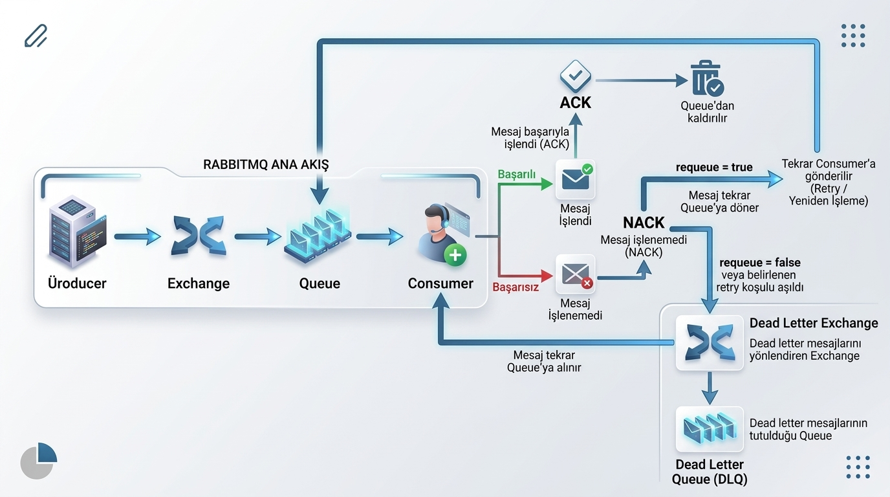
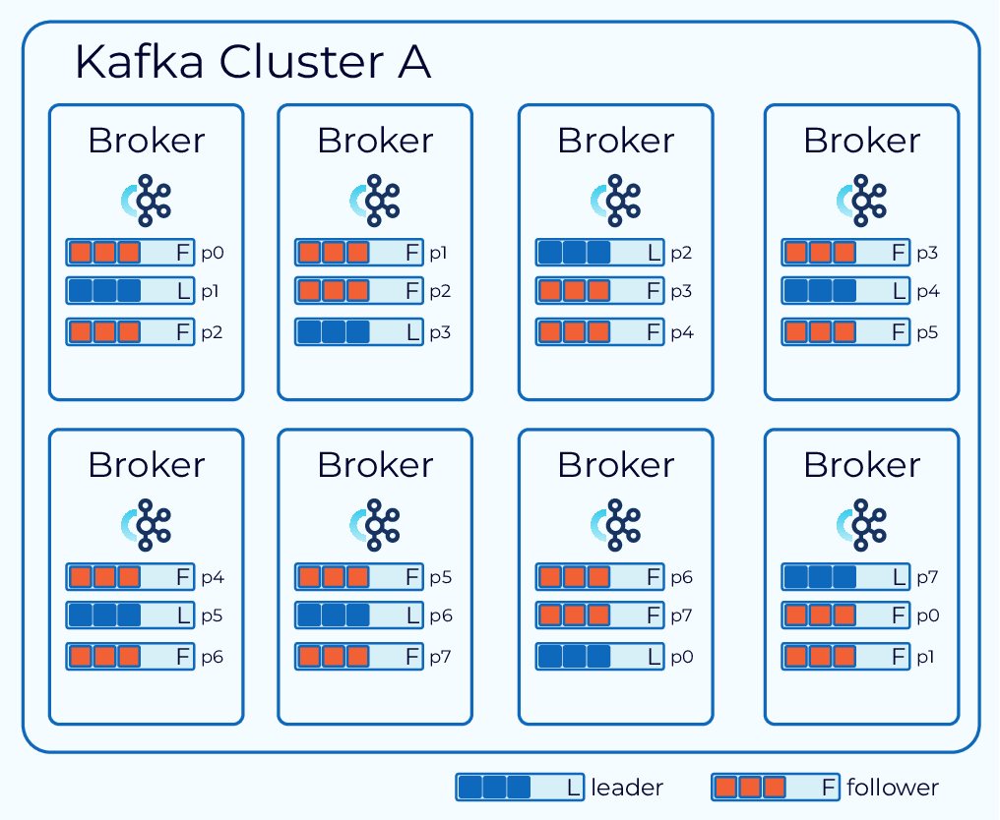

# Mesajlaşma Sistemleri

## Temel Kavramlar

### Asenkron ve Senkron İletişim

**Senkron İletişim:** Gönderici ile alıcının iletişim sırasında eş zamanlı olarak etkileşimde bulunduğu iletişim şeklidir. Gönderici mesajı veya isteği gönderdiğinde alıcının vereceği yanıtı bekler. Bu bekleme sırasında gönderici ilgili işleme devam edemez ve işlem **bloklanır**. Alıcı yanıt verdiğinde ise gönderici beklediği yerden işlemine devam eder.

**Asenkron İletişim:** Gönderici ile alıcının aynı anda aktif olmak zorunda olmadığı iletişim şeklidir. Gönderici mesajını gönderir ve karşı tarafın mesajı hemen işlemesini beklemeden kendi işlemine devam eder. Mesaj bir kuyruğa bırakılabilir ve alıcı müsait olduğunda mesajı alıp işleyebilir. Böylece gönderici ile alıcının aynı anda çalışması gerekmez.

Senkron iletişimi telefonla canlı konuşmaya, asenkron iletişimi ise SMS üzerinden mesajlaşmaya benzetebiliriz.

Senkron iletişimin en önemli özelliği, göndericinin yanıt gelene kadar beklemesidir. Bu sırada ilgili işlem bloklanabilir. Asenkron iletişimde ise gönderici, alıcının mesajı işlemesini beklemeden kendi işlemine devam edebilir.

### Message (Mesaj) Nedir?

Mesajlaşma sistemlerinde **Message (Mesaj)**, bir sistemden diğerine aktarılan verinin kendisidir.

- Bu veri bir kullanıcının ID'si, bir sipariş detayı, bir e-posta içeriği veya bir log kaydı olabilir.
- Sistemler arasında kolayca taşınabilmesi için genellikle **JSON veya XML** gibi veri formatlarında biçimlendirilir. Ancak mesajlar sadece bu formatlarda olmak zorunda değildir, farklı veri formatları veya binary veriler de kullanılabilir.
- Örnek mesaj içeriği:

```json
{
  "siparis_id": 12345,
  "tutar": 500,
  "kullanici_eposta": "ahmet@mail.com"
}
```

Mesajlar amaçlarına göre Event ve Command olmak üzere ikiye ayrılabilir.

**Event mesajları**, sistemde bir olayın gerçekleştiğini bildirmek için kullanılan mesajlardır. Event, bir işlemin gerçekleştiğini duyurur ve bu olaya ilgi duyan bir veya birden fazla Consumer bu mesajı alarak kendi işlemlerini gerçekleştirebilir. Event mesajında genellikle belirli bir Consumer'a "şunu yap" şeklinde bir talimat verilmez.

**Command mesajları** ise belirli bir Consumer'dan veya servisten bir işlemi gerçekleştirmesini istemek amacıyla gönderilen mesajlardır. Yani Command, yapılması istenen bir işlemi ifade eder.

### Queue Nedir?

Queue (Kuyruk), gönderilen mesajların alınıp işlenene kadar tutulduğu ve tüketicilerin (consumer) mesajları almasına aracılık eden bir veri yapısıdır.

- Kuyrukta bulunan mesajlar bellekte veya disk üzerinde tutulabilir.
- Temel çalışma prensibi genellikle FIFO (First In, First Out) – İlk Giren İlk Çıkar şeklindedir. Yani kuyruğa gelen ilk mesaj, diğer koşullar aynı olduğunda ilk olarak işlenir.

### Message Queue Nedir?


**Producer → Gönderici**  
**Consumer → Alıcı / Tüketici**

Bir olay veya yapılması gereken bir iş ile ilgili birbiri ardına yapılacak eylemlerde **Message Queue (Mesaj Kuyruğu)** kullanılabilir. Amaç, yapılması gereken işi bir mesaj olarak kuyruğa bırakmak ve sonrasında ilgili consumer'ların bu mesajı alıp kendi görevlerini yerine getirmesini sağlamaktır.

İlgili iş bir **mesaj olarak kuyruğa gider**. Bu mesaja bağlı sistemler, müsait olduklarında veya tüketim mekanizmasına göre kuyruktan mesajı alır ve buna göre işlemlerini yapar. Böylece producer, consumer'ın işlemi tamamlamasını beklemek zorunda kalmaz. Bu nedenle servisler arasındaki **senkron bekleme azalır** ve sistem daha esnek bir şekilde çalışabilir.

Burada 2 temel yapı vardır:

- **Producer:** Yapılması istenen işi bir **message** olarak kuyruğa iletir.
- **Consumer:** İletilen message'ı kuyruktan alıp işler.

Bu sayede servisler **asenkron olarak çalışabilir** ve birbirleri arasında doğrudan bir bağımlılık olmaz. Daha doğru bir ifadeyle, servislerin birbirine olan **doğrudan ve anlık bağımlılığı azalır**. Producer, consumer'ın o anda çalışır durumda olup olmadığını veya işlemi ne kadar sürede tamamlayacağını beklemek zorunda kalmaz.

Örneğin bir e-ticaret sisteminde kullanıcı sipariş verdiğinde, sipariş sistemi ödeme veya e-posta servisinin işlemini tamamlamasını beklemek yerine gerekli mesajı kuyruğa bırakabilir. İlgili consumer'lar mesajı kuyruktan alarak kendi işlemlerini gerçekleştirir.

```text
            Sipariş Sistemi
              (Producer)
                   │
                   │ Sipariş mesajı
                   ↓
            ┌──────────────┐
            │    Queue     │
            └──────────────┘
                   │
          ┌────────┼────────┐
          ↓        ↓        ↓
       Ödeme    Stok     E-posta
      Consumer  Consumer  Consumer
```

### Message Broker Nedir?

Uygulamalar ve sistemler arasındaki mesajlaşmayı düzenleyen bir **ara katmandır**. Uygulamaların birbirleriyle doğrudan iletişim kurması yerine mesajların bir **Message Broker** üzerinden iletilmesini sağlar.

Producer'ın bir mesaj yollamak istediğini düşünelim. Yukarıdaki örnekten devam edecek olursak bir sipariş oluşturulduğunda, bunun bilgisi bir **mesaj** olarak Producer tarafından Message Broker'a gönderilir. Message Broker ise aldığı mesajı, kullanılan teknolojiye ve belirlenen yönlendirme kurallarına göre ilgili Consumer'lara ulaştırır.


Burada gönderici (**Producer**) ve alıcı (**Consumer**) birbirlerinin çalışma detaylarını doğrudan bilmek zorunda değildir. Producer mesajı gönderir, Consumer ise kendisi için gelen mesajı alarak gerekli işlemleri gerçekleştirir. Böylece sistemdeki bileşenler birbirine doğrudan bağımlı olmadan iletişim kurabilir. Bu duruma **gevşek bağlılık (loose coupling)** denir.

#### Message Broker Neden Kullanılır?

* **Gevşek Bağlılık (Loose Coupling):** Servisler doğrudan birbirine bağımlı olduğunda, birindeki değişiklik diğer servisi de etkileyebilir ve sistemin esnekliği azalabilir. Message Broker kullanılarak servisler arasındaki doğrudan bağımlılık azaltılabilir.

* **Güvenilirlik:** Message Broker'lar, kullanılan teknolojiye ve yapılandırmaya bağlı olarak mesajları kalıcı olarak, örneğin disk üzerinde saklayabilir. Sistemde bir sorun veya çökme meydana geldiğinde, kalıcı olarak saklanan mesajların daha sonra tekrar işlenebilmesi sağlanabilir.

* **Asenkron İletişim:** Producer'ın mesajı gönderdikten sonra Consumer'ın işlemi tamamlamasını beklemesi gerekmez. Böylece özellikle uzun süren işlemlerde servisler arasındaki doğrudan bekleme ve bloklama azaltılabilir.

* **Ölçeklenebilirlik:** Artan iş yükünü karşılamak için sisteme daha fazla Consumer eklenebilir. Kullanılan mesajlaşma modeline ve teknolojiye bağlı olarak mesajların Consumer'lar arasında dağıtılması sağlanarak yatay ölçekleme yapılabilir.

#### Message Broker Nasıl Çalışır?

Message Broker'ın genel çalışma mantığı şu şekilde düşünülebilir:

```text
Producer
    ↓
Message Broker
    ↓
Consumer
```

1. Producer, yani bir uygulama veya servis, bir mesaj oluşturur.
2. Producer, belirli bir queue veya topic üzerine göndermek üzere mesajı hazırlar.
3. Producer, oluşturduğu mesajı Message Broker'a gönderir.
4. Mesaj, doğrudan bir queue'ya veya bir exchange/topic üzerinden yönlendirilmek üzere broker'a ulaştırılır.
5. Broker, aldığı mesajı belirlenen kurallara göre işler ve saklama yerine (queue / topic / exchange) yerleştirir.
6. Consumer (tüketici), belirli bir kuyruk veya topic'e abone olur veya kuyruğu dinlemeye başlar.
7. Broker, mesajı Consumer'a iletir. Buradaki iletim şekli broker türüne göre değişiklik gösterir.
8. Consumer mesajı işledikten sonra, mesajı güvenli bir şekilde aldığını ve işlediğini belirten bir acknowledge bildirimi gönderebilir.

Consumer mesajı işleyemezse ilgili mesaj belirli bir tekrar deneme politikasına (retry) göre yeniden gönderilir. Bu tekrar gönderme sayısı boyunca işlem başarılı olmadıysa mesajlar *Dead Letter Queue* adında özel bir alt kuyruk yapısında depolanır.
Mesajlar yalnızca işlenemediğinde değil, mesajın time to live yani ömrü dolduğunda veya kuyruk kapasitesi ya da maksimum mesaj boyutu sınırı aşıldığında da Dead Letter Queue'ya yönlendirilir.

**Her Message Broker mesajları aynı şekilde yönlendirmez.** Kullanılan teknolojiye göre Queue, Exchange, Topic, Partition veya Subscription gibi farklı yapılar kullanılabilir.

Bu nedenle Message Broker'ın iç yapısını anlamak için kullanılan teknolojilerin çalışma şekillerine bakmak gerekir.

#### Broker'lar Mesajı Nasıl Yönlendirir?

Her Message Broker, mesajı Consumer'a ulaştırırken aynı yapıyı kullanmaz. Kullanılan teknolojiye göre **Queue, Exchange, Topic, Partition** veya **Subscription** gibi farklı yapılar kullanılabilir.

Genel olarak üç temel yaklaşım öne çıkar:

- **Queue tabanlı:** Mesaj doğrudan bir kuyruğa düşer, Consumer oradan alır.
- **Exchange üzerinden:** Mesaj önce bir ara katmana gönderilir, oradan ilgili kuyruklara dağıtılır.
- **Topic tabanlı:** Mesaj bir konuya yazılır, o konuyu dinleyen taraflar mesajı alır.

| Yaklaşım | Örnek Teknoloji |
|---|---|
| Queue tabanlı | Amazon SQS |
| Exchange → Queue | RabbitMQ |
| Topic → Partition | Apache Kafka |
| Topic → Subscription | Apache Pulsar |

> Bu yapıların detayları (Exchange türleri, Partition, Subscription vb.) ilgili teknoloji başlıkları altında ayrıca anlatılacaktır.

---

## Message Broker Teknolojileri

Message Broker ve mesajlaşma sistemlerinde farklı teknolojiler kullanılabilir:

* **RabbitMQ**
* **Apache Kafka**
* **Apache Pulsar**
* **ActiveMQ**
* **NATS**
* **Amazon SQS**
* **Amazon SNS**
* **Google Cloud Pub/Sub**
* **Azure Service Bus**
* **Redis Streams**

Bu teknolojilerin tamamı mesajlaşma amacıyla kullanılsa da çalışma modelleri, kullandıkları veri yapıları ve sundukları özellikler birbirinden farklıdır.

### RabbitMQ

RabbitMQ, 2007 yılında LShift ve CohesiveFT şirketleri tarafından geliştirilen bir Message Broker yazılımıdır. Mesajlar, ilgili Consumer tarafından işlenene kadar Queue içerisinde tutulabilir.

RabbitMQ, varsayılan olarak AMQP (Advanced Message Queuing Protocol) protokolünü kullanır. Bunun dışında MQTT, STOMP ve HTTP tabanlı API'ler gibi farklı iletişim yöntemlerini de destekler.

Bu protokolleri kısaca açıklamak gerekirse:

- **AMQP (Advanced Message Queuing Protocol):** RabbitMQ'nun temel mesajlaşma protokolüdür. Mesajların güvenilir bir şekilde iletilmesini ve Exchange yapısı üzerinden farklı Queue'lara esnek bir şekilde yönlendirilmesini sağlar.
- **MQTT (Message Queuing Telemetry Transport):** Özellikle IoT ve kaynakları kısıtlı cihazlar için tasarlanmış, hafif bir Publish/Subscribe protokolüdür. RabbitMQ, MQTT desteği sayesinde IoT cihazlarından gelen mesajların sisteme alınmasını ve işlenmesini sağlayabilir.
- **STOMP (Simple Text Oriented Messaging Protocol):** Basit, metin tabanlı ve okunması kolay bir mesajlaşma protokolüdür. Özellikle web uygulamaları ve WebSocket tabanlı uygulamalarla mesajlaşma senaryolarında kullanılabilir.
- **HTTP / WebSocket:** RabbitMQ'nun Management UI ve HTTP API gibi bileşenlerinde HTTP kullanılabilir. Ayrıca RabbitMQ'nun Web STOMP ve Web MQTT gibi eklentileri sayesinde WebSocket üzerinden tarayıcılarla iletişim kurulabilir.

RabbitMQ'nun önemli kullanım amaçlarından biri, web sunucusunun uzun süren veya kaynak tüketen işlemlerle doğrudan uğraşmasını azaltmaktır. Bunun için web sunucusu işlemi doğrudan gerçekleştirmek yerine mesajı RabbitMQ'ya gönderir. Mesaj Queue içerisinde tutulur ve uygun bir Consumer/Worker tarafından işlenir.

Bu yapı sayesinde mesajlar birden fazla Consumer'a dağıtılabilir ve işlemler Worker'lar arasında paylaştırılabilir. Böylece uygulamanın yükünün dengelenmesine ve uzun süren işlemlerin ana uygulama akışından ayrılmasına yardımcı olunur.

#### RabbitMQ Nasıl Çalışır?

```text
                 RabbitMQ
                    │
                    ▼
Producer ──────► Exchange
                    │
              Routing Key
                    │
              ┌─────┴─────┐
              ▼           ▼
           Queue 1      Queue 2
              │           │
              ▼           ▼
          Consumer 1   Consumer 2
```

1. Producer bir mesaj oluşturur ve bu mesajı RabbitMQ içerisindeki Exchange'e gönderir.
2. Exchange; Routing key ve exchange tipine göre uygun Queue'yu belirler ve mesajı bu Queue'ya gönderir.
3. Mesaj ilgili Queue'da sırasını bekler ve Consumer mesajı alır.

#### Routing Key

Exchange'in mesajı nereye yönlendireceğine karar vermesinde kullanılan anahtardır.

```text
routing_key = "order.created"
```

Buradaki `order.created` bir routing key değeridir. Bu değerin ne anlama geldiğini uygulama kendisi belirler. Örneğin `order.created`, bir siparişin oluşturulduğunu ifade eden bir routing key olarak kullanılabilir.

Özellikle Topic Exchange kullanıldığında routing key içerisindeki bölümler `.` ile ayrılarak belirli kategorileri ifade etmek için kullanılabilir. Örneğin:

```text
order.created
order.cancelled
order.updated
```

Burada `order` siparişle ilgili mesajları, `created`, `cancelled` ve `updated` ise sipariş üzerinde gerçekleşen farklı olayları ifade edecek şekilde kullanılabilir.

#### Binding

Binding, Exchange ile Queue arasındaki yönlendirme bağlantısıdır. Bu bağlantı üzerinde Exchange'in mesajı hangi durumda Queue'ya göndereceğini belirleyen binding key bulunabilir.

```text
Exchange
    │
    │ Binding
    ↓
 Queue1
```

#### Exchange

Exchange, RabbitMQ içerisinde mesajların hangi Queue'lara yönlendirileceğini belirleyen yapıdır. Bir nevi mesaj yönlendirme noktası gibi düşünülebilir.
Mesajların hangi Queue'lara yönlendirileceğini belirlemek için 4 adet exchange türü kullanılır. Bunlar: direct, fanout, topic ve headers.

##### Direct Exchange

Routing key ile tam eşleşme aranır. Örneğin:

```text
Producer
   │
   │ routing_key = "pdfprocess"
   ▼
Direct Exchange
   │
   │ binding_key = "pdfprocess"
   ▼
PDF Queue
```

`pdfprocess` adlı queue'yu arar ve mesajı oraya iletir. Eğer bulamazsa iletim sağlanmaz.

##### Fanout Exchange

Burada routing key'e bakılmaksızın ilgili mesaj tüm queue'lara iletilir.

```text
              Exchange
                 │
       ┌─────────┼─────────┐
       ↓         ↓         ↓
    Queue 1   Queue 2   Queue 3
```

##### Topic Exchange

İlgili mesajları routing key'deki kategorisine göre ilgili Queue'ya yönlendirir. Örneğin:

```text
order.created
order.cancelled
```

Topic Exchange'de routing key, `.` ile ayrılmış kelimelerden oluştuğu için binding key tarafında joker karakterler (wildcard) kullanılabilir:

- `*` → Tam olarak **bir kelimenin** yerine geçer.
- `#` → **Sıfır veya daha fazla kelimenin** yerine geçer.

Örneğin:

```text
order.*  → order.created      ✔
           order.cancelled    ✔
           order.item.created ✘

order.#  → order.created      ✔
           order.cancelled    ✔
           order.item.created ✔
```

Yani `order.*` yazdığımızda order ile başlayıp arkasında yalnızca tek bir kelime gelen mesajlar ilgili Queue'ya gider. `order.#` yazdığımızda ise order ile başlayan, arkasında kaç kelime geldiğine bakılmaksızın tüm mesajlar ilgili Queue'ya gider. Topic Exchange anlatılırken en çok sorulan kısım bu iki karakterdir.

##### Headers Exchange

Mesajların ilgili Queue'ya gitmesi için gereken yönlendirmeyi routing key ile değil, mesajın header bilgisine göre yapar.


<small>*Görsel Kaynağı: [Rahul P Nath — RabbitMQ Headers Exchange](https://www.rahulpnath.com/blog/headers-exchange-rabbitmq-dotnet)*</small>

#### ACK ve Mesaj İşleme

Burada amaç, Consumer mesajı Queue'dan aldıktan sonra RabbitMQ'nun mesajın başarıyla işlenip işlenmediğini takip edebilmesidir.



Consumer Queue'yu dinler ve Queue'daki ilgili mesajı alır.
Sonra mesajı işlemeye başlar. Eğer mesaj başarılı bir şekilde işlendiyse RabbitMQ'ya bir ACK (Acknowledgement) yollar. Yani RabbitMQ'ya "Ben bu mesajı başarıyla işledim." anlamında bilgi verir.
RabbitMQ, ilgili mesajın Consumer tarafından başarıyla işlendiğini ACK üzerinden öğrenir ve mesajı artık tekrar teslim edilmesi gereken bir mesaj olarak tutmaz.

RabbitMQ ilgili ACK mesajını alamazsa ne olur?

Consumer mesajı işleyemezse, bu işlemi gerçekleştiremediğini RabbitMQ'ya NACK (Negative Acknowledgement) bildirimi ile bildirebilir.

NACK gönderilirken mesajın tekrar Queue'ya alınıp alınmayacağı belirlenebilir. Eğer `requeue = true` olarak belirtilirse mesaj tekrar Queue'ya alınır ve yeniden işlenmesi sağlanır. RabbitMQ, mesajı mümkün olduğunca önceki konumuna yakın bir yere yerleştirir. Bu işleme requeue denir.

Peki ya mesajın işlenmesinde karşılaşılan sorun geçici bir durum değilse ne olur? Mesaj sürekli tekrar işlenmeye mi çalışılır?

Elbette hayır. Eğer `requeue = true` kullanılmaya devam edilirse mesaj tekrar tekrar Queue'ya alınarak sürekli işlenmeye çalışılabilir. Bu nedenle başarısız mesajların kontrollü bir şekilde ele alınması gerekir.

Burada Dead Letter Exchange (DLX) kavramı devreye girebilir. Belirli koşulları sağlayan veya işlenemeyen mesajlar Dead Letter Exchange'e yönlendirilebilir. DLX bir Exchange yapısıdır ve bu Exchange'e yönlendirilen mesajları saklamak için genellikle bir Dead Letter Queue (DLQ) kullanılır.

Bu kuyruk yapısında normal şekilde işlenemeyen veya belirli şartlar nedeniyle Queue'dan çıkarılan mesajlar tutulabilir. Amaç, mesajın tamamen kaybolmasını önlemek ve sorunlu mesajları daha sonra inceleyebilmektir. Eğer sorun mesajın kendisinden kaynaklanıyorsa geliştiriciler Dead Letter Queue içerisindeki mesajları inceleyerek gerekli düzeltmeleri yapabilir.

#### RabbitMQ'da Sık Karşılaşılan Sorunlar

- Yüksek bellek kullanımı, aracı sunucu çökmeleri.
- Düğümlerin yavaş bağlanması ve senkronizasyon sırasında performans düşüşü sonucu küme senkronizasyon sorunları.
- Çok sayıda kuyruk olması durumunda performans düşüşü yaşanır.

### Apache Kafka

Kafka, 2011 yılında LinkedIn tarafından geliştirilen ve daha sonra Apache çatısı altında açık kaynak olarak sürdürülen bir Message Broker yazılımıdır.

Kafka; mesajlaşma sistemi olarak, uygulama loglarının toplanması, kullanıcı aktivitelerinin takip edilmesi, gerçek zamanlı veri akışlarının işlenmesi ve farklı sistemler arasında veri aktarılması gibi birçok farklı amaçla kullanılabilir.

Özellikle birden fazla kaynak sistemin ve birden fazla hedef sistemin bulunduğu yapılarda sistemlerin birbirleriyle doğrudan iletişim kurması yerine Kafka araya girerek bu sistemlerin birbirinden bağımsız çalışmasına yardımcı olabilir.

Örneğin bir e-ticaret sisteminde sipariş oluşturulduğunda bu bilgi;

- Sipariş servisinin,
- Ödeme servisinin,
- Bildirim servisinin,
- Stok servisinin

gibi farklı servislerin ilgisini çekebilir.

Her servisin birbirine doğrudan bağlanması yerine sipariş ile ilgili event Kafka'ya gönderilebilir ve ilgili servisler bu event'i kendi ihtiyaçlarına göre okuyabilir.

#### Kafka Nasıl Çalışır?

```text
Producer
   │
   ▼
 Topic
   │
   ├── Partition 0
   ├── Partition 1
   └── Partition 2
           │
           ▼
        Consumer
```

1. Producer, Kafka'ya bir mesaj veya event gönderir.
2. Mesaj belirli bir Topic içerisinde tutulur.
3. Topic, bir veya daha fazla Partition içerebilir.
4. Mesaj ilgili Partition'ın sonuna eklenir ve bir Offset değeri alır.
5. Consumer, Topic içerisindeki Partition'lardan mesajları okur.

#### Topic & Partition

Kafka'da mesajların veya event'lerin gönderildiği ve tutulduğu kategoridir. Örneğin bir e-ticaret uygulamasını ele alalım. Burada `orders`, `payments` ve `notifications` topic'leri oluşturulabilir.
Sipariş oluşturulduğunda `OrderCreated` mesajı/event'i `orders` topic'ine gönderilebilir.

Topic'ler kendi içerisinde bir veya birden çok Partition'a ayrılabilir. Örneğin:

```text
orders Topic
│
├── Partition 0
├── Partition 1
└── Partition 2
```

Burada Partition'ları birer kuyruk olarak düşünebiliriz. Mesela `orders` diye bir topic'imiz var, değil mi? Bunun partition parçalarını

```text
Partition 0 -> users bilgilerini tutan queue
Partition 1 -> ürün bilgilerini tutan queue
```

şeklinde düşünebiliriz. Topic ise bu Partition'lardan birbiriyle ilgili olanların tek bir bölümde toplanması, yani kategorileşmesi olarak düşünülebilir.

Apache Kafka'da mesajların sırası Partition içerisinde garanti edilir. Yani Partition 0 veya 1 arasındaki sıra, mesaj iletirken önemli değildir; önemli olan Partition içerisindeki hücrelerde bulunan mesajların sırasıdır.


<small>*Görsel Kaynağı: [Siva Yuvi — Kafka Partition (Hashnode)](https://sivayuvi79.hashnode.dev/kafka-partition)*</small>

#### Offset

Offset, bir mesajın bulunduğu Partition içerisindeki konumunu belirten değerdir ve Offset değerleri Partition içerisinde artarak devam eder. Örneğin:

```text
Partition 0

Offset 0 → Message A
Offset 1 → Message B
Offset 2 → Message C
Offset 3 → Message D
```

#### Offset Commit

Consumer, Partition'daki mesajları okudukça hangi Offset'e kadar okuduğunu Kafka'ya bildirir. Bu işleme **Offset Commit** denir. RabbitMQ'daki ACK'e benzetilebilir. RabbitMQ'da Consumer "Ben bu mesajı başarıyla işledim." diye ACK gönderirken, Kafka'da Consumer "Ben şuraya kadar okudum." diye Offset commit eder. Örneğin:

```text
Partition 0

Offset 0 → Message A   ✔ okundu
Offset 1 → Message B   ✔ okundu
Offset 2 → Message C   ✔ okundu
Offset 3 → Message D   (henüz okunmadı)
```

Burada Consumer, Offset 2'ye kadar okuduğunu Kafka'ya bildirmiştir. Consumer bir sebepten durup tekrar başlarsa kaldığı yerden, yani Offset 3'ten devam edebilir.

#### Retention (Mesajların Saklanması)

Kafka'da mesajlar Consumer tarafından okunduğunda silinmez. Mesajlar belirli bir süre veya boyuta kadar Kafka'da saklanır. Örneğin saklama süresi 7 gün olarak ayarlanırsa mesajlar okunmuş olsa bile 7 gün boyunca Partition içerisinde durur.

Bu sayede Consumer isterse eski bir Offset'e dönüp aynı mesajları tekrar okuyabilir:

```text
Partition 0

Offset 0 → Message A
Offset 1 → Message B
Offset 2 → Message C   ← Consumer buraya kadar okudu
Offset 3 → Message D

Consumer isterse Offset 0'a dönüp Message A'dan tekrar okuyabilir.
```

RabbitMQ'da ise mesaj Consumer tarafından işlenip ACK gönderildikten sonra artık tekrar teslim edilmesi gereken bir mesaj olarak tutulmaz. Bu, RabbitMQ ile Kafka arasındaki en temel farklardan biridir.

#### Consumer Group


Birden fazla Consumer'ın birlikte çalışmasını sağlamak için Consumer Group yapısı kullanılır. Bu grup içerisinde bulunan Consumer'lar Partition'ları kendi aralarında paylaşabilir.

Bir Consumer Group içerisinde aynı Partition aynı anda yalnızca bir Consumer'a atanabilir! Bu yapı sayesinde mesajların işlenmesi Consumer'lar arasında paylaştırılabilir ve işlemler paralel olarak gerçekleştirilebilir. Bu sayede aynı iş yükü birden fazla Consumer tarafından paylaşılabilir.

Partition sayısı, bir Consumer Group içerisindeki paralel tüketim kapasitesini etkiler. Bir Partition aynı anda birden fazla Consumer'a atanamayacağı için, örneğin:

```text
Bir topic'te partition: 3 ve consumer: 3 olsun

Partition 0 → Consumer 1 
Partition 1 → Consumer 2 
Partition 2 → Consumer 3
---------------------------------------
partition: 3 ve consumer: 4 olsun

Partition 0 → Consumer 1 
Partition 1 → Consumer 2 
Partition 2 → Consumer 3
Consumer 4 → boşta olur
```

#### Broker

Broker, Kafka'nın çalıştığı sunucudur. Birden fazla Broker bir araya gelerek Kafka Cluster'ını oluşturur. Örneğin:

```text
Kafka Cluster
      │
      ├── Broker 1
      ├── Broker 2
      └── Broker 3
```


<small>*Kaynak: [Confluent Developer — Apache Kafka Architecture: Data Replication](https://developer.confluent.io/courses/architecture/data-replication/)*</small>

#### Replication

Kafka dağıtık bir sistem olduğu için Broker'lardan birinin başarısız olması durumunda verilerin kullanılabilir kalması önemlidir.

Bunun için Kafka, Replication adında bir yapı kullanır. Replication ile bir Partition'ın kopyası birden fazla Broker üzerinde tutulabilir. Bu sayede bir Broker'da problem oluştuğunda diğer replica'lar kullanılabilir.

**Replication Factor:** Bir Partition için kaç replica tutulacağını belirleyen değerdir.

#### Leader ve Replica

Bir Partition'ın replica'ları arasında bir tanesi Leader olarak görev yapar. Producer'ın Partition'a yazma işlemi Leader üzerinden gerçekleştirilir. Diğer replica'lar Leader'daki verileri takip ederek kendi kopyalarını günceller.

### Apache Pulsar

Yahoo tarafından geliştirilmiş, daha sonra Apache çatısı altına alınmış açık kaynaklı bir Message Broker yazılımıdır. Apache Pulsar, Broker ve BookKeeper/Bookie olmak üzere iki katmandan oluşur. Broker, sunucu katmanı olarak mesajların alınmasından ve iletilmesinden sorumluyken, BookKeeper depolama katmanı olarak mesajların kalıcı olarak saklanmasından sorumludur. BookKeeper içerisindeki depolama sunucularına Bookie adı verilir.


<small>*Kaynak: [Apache Pulsar Documentation — Architecture Overview](https://pulsar.apache.org/docs/next/concepts-architecture-overview/)*</small>

Okuma işlemleri için yalnızca 1 Bookie yeterlidir. Diğer Bookie'ler ilgili konu (topic) için depolama alanını çoğaltmada kullanılır. Okuma işlemlerinde bir Bookie kullanmadan, doğrudan Pulsar Broker'ın kuyruğu üzerinden de okuma yapılabilir. Buna **topic compaction** (konu sıkıştırma) denir. Topic compaction, her anahtar-değer çifti için yalnızca en son değeri bellekte tutar.

Apache Pulsar, düşük gecikme süresi, yüksek verimlilik ve ölçeklenebilirliğin kritik olduğu uygulamalarda faydalıdır. Örneğin gerçek zamanlı analiz, IoT ve makine öğrenimi uygulamalarında kullanılabilir. Apache Flink, Apache Spark ve Apache Storm gibi çerçevelerle sorunsuz bir şekilde entegre olabilmesi, veri işleme ve analizindeki faydasını artırır.

RabbitMQ ve Kafka arasında bir yerde konumlanan bu platform, RabbitMQ gibi düşük gecikme süresi ve esnek mesajlaşma yapısı sunarken, Kafka gibi yüksek ölçeklenebilirlik ve kalıcı veri saklama özelliklerine de sahiptir. Tüm bunların yanı sıra çoklu kiracılık (multi-tenancy) ve yerleşik coğrafi çoğaltma (geo-replication) gibi özellikler de sunar.

Apache Pulsar, veri alım mekanizması (data ingestion) olarak görev yaparak data lake mimarisinde önemli bir bileşen olabilir. Verileri data lake'e aktararak gerçek zamanlı veri işleme ve analizini mümkün kılar; böylece data lake kurulumunda gerçek zamanlı ve toplu işleme ortamları arasında bir köprü görevi görür.


<small>*Kaynak: [In-Depth Guide on Apache Pulsar — Akash S. Das](https://medium.com/@akashsdas_dev/in-depth-guide-on-apache-pulsar-89122f3780cd)*</small>

#### Topic

Mesajların soyut bir gösterimi veya gruplandırılmasıdır.

#### Namespace

İlgili Topic'leri gruplandırmak için kullanılan mekanizmadır. Bir Namespace'in barındırabileceği Topic sayısının herhangi bir sınırı yoktur.

#### Tenants

Depolama alanının kapasitesini ayarlamak ve kimlik doğrulama şemalarını uygulamak için kullanılan yönetim birimleridir. Tek bir Tenant bünyesinde birden fazla Namespace bulunabilir ve bir Tenant farklı kümeler (cluster) arasında da varlığını sürdürebilir.

Yeni bir Topic oluştururken hem Namespace hem de Tenant adını belirtebilirsin. Bunları açıkça belirtmezsen, Topic otomatik olarak sistemin varsayılan (default) Tenant ve Namespace'i altında oluşturulur.

#### Subscription Types (Abonelik Türleri)

Consumer'ların kullanabileceği 4 farklı abonelik türü vardır. Kullanacağın abonelik türünü seçerken sıralama ve ölçeklenebilirlik ihtiyacına göre karar vermelisin.

1. Exclusive
2. Failover
3. Shared
4. Key_Shared


<small>*Kaynak: [Apache Pulsar Documentation — Messaging Concepts](https://pulsar.apache.org/docs/next/concepts-messaging/)*</small>

**Exclusive:** Bir Topic'e yalnızca 1 Consumer abone olabilir. Bu nedenle sistemde yatay ölçekleme yapılamaz, ancak mesajların gönderildiği sırayla işleneceğini garanti eder.

**Failover:** Birden fazla Consumer'ın aynı Topic'e abone olmasına izin verir. Yalnızca Master Consumer aktif olarak mesajları alır. Master Consumer'ın bağlantısı koparsa sıradaki yedek Consumer mesajları almaya başlar. Bu yöntem de tüketimi paralel hale getirmediği için ölçeklenebilir değildir, fakat mesaj sıralamasını korur.

**Shared:** Birden fazla Consumer, Broker'dan aynı anda mesaj okuyabilir. Mesajlar sırayla Consumer'lara dağıtılır. Bir Consumer ACK göndermeden bağlantısı koparsa o mesaj kalan Consumer'lardan birine yeniden iletilir. Bu sayede yatay ölçekleme sağlanır, ancak mesaj sıralaması korunmaz.

**Key_Shared:** Birden fazla Consumer aynı Topic'e abone olabilir. Producer mesajı gönderirken bir anahtar (key/ordering key, örneğin `user_id`) belirtir; sistem aynı anahtara sahip tüm mesajları her zaman aynı Consumer'a yönlendirir. Böylece aynı kullanıcıya ait işlemler kendi içinde sıralı kalırken, farklı kullanıcıların mesajları diğer Consumer'lara paralel olarak dağıtılır. Bu sayede hem ölçeklenebilirlik hem de sıralamaya bağlı kalınabilir.

### ActiveMQ

ActiveMQ, 2004 yılında LogicBlaze (James Strachan ve ekibi) tarafından geliştirilen ve 2007 yılından itibaren Apache çatısı altında açık kaynak olarak sürdürülen bir Message Broker (Mesaj Aracısı) yazılımıdır. AMQP, STOMP, MQTT ve diğerleri de dahil olmak üzere geniş bir protokol yelpazesine sahiptir. Master-Slave mimarisi ve paylaşımlı depolama kümelemesi (shared storage clustering) özelliklerine sahiptir.

Kafka ve RabbitMQ gibi iletim sorumluluğunu tek bir yere yüklemek yerine Broker ile istemci arasında dengeli, geleneksel bir yaklaşım kullanır. Mesajlar doğrudan Queue'lara veya Topic'lere gönderilir. Hem Exchange hem de Topic üzerinden iletim sağlayabildiği için oldukça esnek bir mimarisi vardır.

Gecikme süresi açısından RabbitMQ'dan daha yüksek bir gecikmeye sahiptir. ActiveMQ genellikle düşük işlem hacmini (saniyede binlerce mesaj) işler; bu da onu çoğu kurumsal uygulama için uygun hale getirir, ancak yüksek hacimli senaryolar için yetersiz kalabilir. Genellikle geleneksel, eski kurumsal sistemlerde kullanılır.


<small>*Kaynak: [AutoMQ — Apache RabbitMQ vs ActiveMQ: Differences & Comparison](https://www.automq.com/blog/apache-rabbitmq-vs-activemq-differences-amp-comparison)*</small>

#### Çalışma Mekanizması

1. Gönderici ve alıcı uygulamalar, ActiveMQ Broker'ına (sunucusuna) TCP veya AMQP gibi protokoller üzerinden bağlanır.
2. Gönderici uygulama; metin, JSON, XML veya nesne formatında bir mesaj hazırlar.
3. Mesaj, ActiveMQ üzerindeki ilgili hedefe (Queue veya Topic) postalanır.
4. Eğer mesaj "kalıcı" (persistent) olarak işaretlendiyse, ActiveMQ sunucusu çökse bile mesaj kaybolmasın diye diskteki veri tabanına kaydedilir.
5. Alıcı uygulama mesajı başarıyla aldığında ActiveMQ'ya "Mesajı aldım ve işledim" (Acknowledgment / ACK) bilgisi gönderir.
6. ACK bilgisini alan ActiveMQ, mesajı hafızasından veya diskinden tamamen siler.

#### JMS (Java Message Service) Nedir?

JMS, Java tabanlı kurumsal uygulamaların birbirleriyle güvenli ve asenkron (eşzamansız) şekilde mesajlaşabilmesini sağlayan bir Java API standardıdır.

#### ActiveMQ'da Sık Karşılaşılan Sorunlar

- Mesaj iletiminde artan gecikme süresi, mesaj birikimi.
- Broker çökmeleri, performans düşüşü sonucu bellek yetersizliği hataları.

### NATS

Derek Collison tarafından geliştirilen ve günümüzde CNCF (Cloud Native Computing Foundation) çatısı altında sürdürülen, Go dilinde yazılmış açık kaynaklı bir mesajlaşma sistemidir. Adı "Neural Autonomic Transport System" ifadesinden gelir. En belirgin özelliği son derece hafif, basit ve düşük gecikmeli olmasıdır.

RabbitMQ ve Kafka'ya göre çok daha minimal bir yapıya sahiptir. Kurulumu ve yönetimi basittir, harici bir bağımlılığı yoktur (Kafka'nın ZooKeeper'a ihtiyaç duyması gibi bir durum NATS'ta olmaz).

```text
Publisher
   │
   ▼
 NATS Server
   │
   ▼
Subscriber
```

#### Subject (Konu) Bazlı Adresleme

NATS'ta mesajlar Queue veya Topic'e değil, **Subject** adı verilen bir metin etiketine gönderilir. Subject'ler nokta (`.`) ile hiyerarşik olarak yazılır:

```text
orders.created
orders.cancelled
orders.us.created
```

Subscriber'lar bu Subject'lere joker karakterlerle abone olabilir:

- `*` → Tek bir seviyeyi karşılar. Örneğin `orders.*`, `orders.created` ve `orders.cancelled`'ı yakalar; `orders.us.created`'ı yakalamaz.
- `>` → Kendisinden sonraki tüm seviyeleri karşılar. Örneğin `orders.>`, `orders.created` ve `orders.us.created` dahil hepsini yakalar.

#### Temel İletişim Modelleri

- **Publish/Subscribe:** Bir Publisher mesajı bir Subject'e yayınlar, o Subject'i dinleyen tüm Subscriber'lar mesajı alır.
- **Request/Reply:** Bir istemci mesaj gönderip cevap bekler; NATS bu senkron benzeri iletişimi de yerleşik olarak destekler.
- **Queue Group:** Aynı Subject'i dinleyen Subscriber'lar bir Queue Group altında toplanırsa, mesaj gruptaki yalnızca bir Subscriber'a gider. Bu, Kafka'daki Consumer Group'un veya RabbitMQ'daki Point-to-Point dağıtımının NATS'taki karşılığı gibi düşünülebilir.

#### Core NATS ve JetStream

- **Core NATS:** Mesajlar kalıcı olarak saklanmaz. Bir mesaj yayınlandığında, o an dinleyen olmayan Subscriber mesajı kaçırır (at-most-once teslimat). Çok düşük gecikme sağlar.
- **JetStream:** NATS'a sonradan eklenen kalıcılık katmanıdır. Mesajları diskte saklar, at-least-once ve exactly-once teslimat garantisi sunar, Consumer'ların offset takibi yapmasına izin verir. Bu yönüyle Kafka'ya yaklaşır.

#### Öne Çıkan Özellikler

- Çok küçük bir sunucu boyutuna (tek bir binary dosya) sahiptir, kurulumu kolaydır.
- Clustering ile yatay ölçeklenebilir; Leaf Node yapısıyla farklı lokasyonlardaki NATS sunucuları birbirine bağlanabilir.
- Genellikle mikroservisler arası hızlı iletişimde, IoT'de ve edge/uç cihaz senaryolarında tercih edilir.

### Amazon SQS

Amazon SQS (**Simple Queue Service**), Amazon Web Services (AWS) tarafından sunulan, uygulamalar arasında mesajların güvenilir bir şekilde iletilmesini sağlayan **yönetilen (managed) bir Message Queue** servisidir. Uygulamaların birbirleriyle doğrudan iletişim kurması yerine mesajları bir **Queue** üzerinden iletmesini sağlayarak uygulamalar arasındaki bağımlılığı azaltır.

Temel yapısı:

```text
Producer → Queue → Consumer
```

Producer mesajı Queue'ya gönderir, Consumer ise mesajı Queue'dan alarak işler. SQS'nin AWS tarafından yönetilen bir servis olması sayesinde sunucu kurulumu, altyapı yönetimi ve ölçeklendirme gibi işlemlerle doğrudan ilgilenmeye gerek kalmaz.

Amazon SQS'de **Standard Queue** ve **FIFO Queue** olmak üzere iki temel Queue türü bulunmaktadır. Standard Queue yüksek ölçeklenebilirlik ve throughput için kullanılırken, FIFO Queue mesajların belirli bir sırayla işlenmesinin önemli olduğu durumlarda kullanılır.

SQS'de RabbitMQ'daki **ACK** mekanizması yerine, mesaj başarıyla işlendiğinde **DeleteMessage** işlemi kullanılır. Mesaj işlenemezse **Visibility Timeout** süresi sonunda tekrar alınabilir. Belirli sayıda başarısız denemeden sonra mesajların **Dead Letter Queue (DLQ)**'ya gönderilmesi de mümkündür.

RabbitMQ'dan farklı olarak SQS bir **Message Broker kurup yönetme** yaklaşımından ziyade, AWS tarafından yönetilen bir Queue servisi sunar. Kafka'dan farklı olarak ise temel amacı event streaming veya distributed log yapısı oluşturmak değil, uygulamalar arasındaki mesajların Queue üzerinden güvenilir şekilde iletilmesini sağlamaktır.

### Amazon SNS

Amazon SNS (**Simple Notification Service**), Amazon Web Services (AWS) tarafından sunulan, uygulamalar ve servisler arasında mesajların birden fazla alıcıya iletilmesini sağlayan **yönetilen (managed) bir mesajlaşma ve bildirim servisidir**.

SNS'nin temel yapısı **Publisher → Topic → Subscriber** şeklindedir.

```text
Publisher
    ↓
  Topic
  ↙ ↓ ↘
 S1 S2 S3
```

Publisher mesajı **Topic**'e gönderir. Topic ise gönderilen mesajı kendisine abone olan (**Subscriber**) farklı servis veya uygulamalara iletir. Böylece tek bir mesajın birden fazla alıcıya dağıtılması sağlanabilir.

Amazon SNS özellikle **Publish/Subscribe (Pub/Sub)** yapısının kullanıldığı sistemlerde tercih edilir. Örneğin bir e-ticaret sisteminde yeni bir sipariş oluşturulduğunda, aynı mesaj **Payment Service, Notification Service ve Shipping Service** gibi farklı servislere gönderilebilir.

SNS, **SQS ile birlikte** de kullanılabilir. SNS bir mesajı birden fazla SQS Queue'ya dağıtabilir ve böylece farklı servislerin aynı mesajı bağımsız şekilde işlemesini sağlayabilir.

#### Amazon SNS ve Amazon SQS Farkı

| Özellik           | Amazon SNS                           | Amazon SQS                               |
| ----------------- | ------------------------------------ | ---------------------------------------- |
| Temel yapı        | Publish/Subscribe                    | Queue                                    |
| Temel amaç        | Mesajı birden fazla alıcıya dağıtmak | Mesajı Queue'da tutup Consumer'a iletmek |
| Yapı              | Publisher → Topic → Subscriber       | Producer → Queue → Consumer              |
| Mesaj dağıtımı    | Birden fazla Subscriber              | Consumer'lar tarafından alınır           |
| Mesajın tutulması | Temel amacı mesaj saklamak değildir  | Mesajları Queue'da saklar                |
| Kullanım          | Event/Notification dağıtımı          | Asenkron işlem ve mesaj kuyruğu          |

Kısaca **SNS mesajı dağıtmaya**, **SQS ise mesajı Queue'da tutup işlenmesini sağlamaya** odaklanır. Bu nedenle ikisi genellikle birbirinin alternatifi olmaktan ziyade birlikte kullanılabilir.

```text
                SNS Topic
                    ↓
          ┌─────────┼─────────┐
          ↓         ↓         ↓
       SQS Queue  SQS Queue  Service
          ↓         ↓
      Service A  Service B
```

Bu yapıda SNS gelen mesajı dağıtırken, SQS mesajları ilgili servislerin daha sonra işleyebilmesi için Queue'larda tutar.

### Google Cloud Pub/Sub

Google Cloud Pub/Sub, Google Cloud tarafından sunulan, uygulamalar ve servisler arasında **mesajların asenkron olarak iletilmesini** sağlayan, yönetilen (**managed**) bir mesajlaşma servisidir. Temel olarak **Publish/Subscribe (Pub/Sub)** modelini kullanır.

Google Cloud Pub/Sub'ın temel yapısı **Publisher → Topic → Subscription → Subscriber** şeklindedir.

```text
Publisher
    ↓
  Topic
    ↓
Subscription
    ↓
Subscriber
```

Publisher mesajı **Topic**'e gönderir. Topic'e bağlı olan **Subscription**'lar mesajları alır ve Subscriber'lar bu mesajları işleyebilir. Aynı Topic'e birden fazla Subscription bağlanarak aynı mesajın farklı servisler tarafından bağımsız şekilde işlenmesi sağlanabilir.

Google Cloud Pub/Sub, **gerçek zamanlı veri akışları, mikroservisler, event-driven mimariler ve asenkron iletişim** gibi yapılarda kullanılabilir. Google Cloud tarafından yönetildiği için altyapı, ölçeklendirme ve sunucu yönetimi gibi işlemlerle doğrudan ilgilenmeye gerek kalmaz.

### Azure Service Bus

Azure Service Bus, Microsoft Azure tarafından sunulan, uygulamalar ve servisler arasında **mesajların güvenilir ve asenkron bir şekilde iletilmesini** sağlayan, yönetilen (**managed**) bir mesajlaşma servisidir.

Azure Service Bus temel olarak **Queue** ve **Topic/Subscription** olmak üzere iki farklı mesajlaşma yapısı sunmaktadır.

Queue yapısında:

```text
Producer → Queue → Consumer
```

Producer mesajı Queue'ya gönderir ve Consumer mesajı Queue'dan alarak işler. Bu yapı özellikle uygulamalar arasındaki bağımlılığı azaltmak ve işlemleri asenkron hale getirmek için kullanılabilir.

Topic/Subscription yapısında ise:

```text
Publisher
    ↓
  Topic
  ↙   ↘
Sub 1  Sub 2
 ↓      ↓
C1     C2
```

Publisher mesajı Topic'e gönderir ve Topic'e bağlı olan farklı Subscription'lar bu mesajı alabilir. Böylece aynı mesajın farklı servisler tarafından bağımsız şekilde işlenmesi sağlanabilir.

Azure Service Bus; **mikroservisler, event-driven mimariler, asenkron iletişim ve uygulamalar arası mesajlaşma** gibi yapılarda kullanılabilir. Ayrıca mesajların sıralanması, tekrar işlenmesi ve başarısız mesajların yönetilmesi gibi mesajlaşma ihtiyaçları için çeşitli özellikler sunmaktadır.

### Redis Streams

Redis Streams, Redis içerisinde bulunan ve **mesajların sıralı bir şekilde tutulmasını ve tüketiciler tarafından işlenmesini** sağlayan bir veri yapısıdır. Redis'in bellek tabanlı ve yüksek performanslı yapısından yararlanarak gerçek zamanlı veri akışlarının işlenmesini sağlar.

Redis Streams'de temel yapı **Producer → Stream → Consumer** şeklindedir.

```text
Producer
    ↓
  Stream
    ↓
 Consumer
```

Producer mesajları Stream'e ekler ve bu mesajlar bir **ID** ile sıralı şekilde tutulur. Consumer'lar Stream'deki mesajları okuyarak işleyebilir.

Redis Streams ayrıca birden fazla Consumer'ın mesajları birlikte işlemesini sağlayan **Consumer Group** yapısını destekler. Bu sayede mesajların farklı Consumer'lar arasında dağıtılması ve işlenmesi sağlanabilir.

Redis Streams; **gerçek zamanlı veri işleme, event-driven mimariler, log toplama ve mikroservisler arasındaki asenkron iletişim** gibi yapılarda kullanılabilir.

RabbitMQ ve Kafka gibi sistemlerden farklı olarak Redis Streams, bağımsız bir Message Broker yerine **Redis'in sunduğu bir veri yapısıdır**. Bu nedenle Redis'in cache gibi diğer özellikleriyle birlikte kullanılabilir.

---

## İletişim Modelleri

Mesajlaşma sistemlerinde mesajların Producer'dan Consumer'lara nasıl dağıtılacağını belirleyen farklı iletişim modelleri bulunur.

### Point-to-Point (Birebir)

```text
Producer → Queue → Consumer
```

Producer mesajı bir Queue'ya bırakır ve o mesajı **yalnızca bir Consumer** alıp işler. Aynı Queue'yu birden fazla Consumer dinliyor olabilir, ancak her mesaj bunlardan sadece birine gider. Mesajlar Consumer'lar arasında paylaştırıldığı için iş yükü bölüşülür.

Örneğin kuyrukta 3 sipariş mesajı varsa ve 3 Consumer bu kuyruğu dinliyorsa, her Consumer bir siparişi işler. Aynı sipariş iki kez işlenmez. Bu model, "bu iş bir kez yapılsın" denen durumlarda kullanılır. Örneğin bir PDF'in işlenmesi ya da bir ödemenin alınması gibi.

Bir bankadaki gişe sırasına benzetilebilir. Müşteri (mesaj) sıraya girer, boşta olan gişe memurlarından (Consumer) biri ilgilenir. Aynı müşteriyle iki memur ilgilenmez.

### Publish/Subscribe (Yayınla/Abone Ol)

```text
                 → Consumer A
Producer → Broker → Consumer B
                 → Consumer C
```

Producer bir mesajı veya olayı **yayınlar** ve bu mesaj, ilgilenen **birden fazla bağımsız Consumer** tarafından alınabilir. Burada mesaj tek bir Consumer'a değil, abone olan hepsine gider ve her Consumer kendi işini yapar.

Örneğin bir sipariş oluştuğunda ödeme, stok ve e-posta servisleri aynı mesajı alır. Ödeme servisi ödemeyi çeker, stok servisi stoğu düşürür, e-posta servisi bildirim gönderir. Producer bu servislerin kim olduğunu bilmek zorunda değildir.

Bir radyo yayınına benzetilebilir. Yayıncı bir kez yayın yapar, frekansı dinleyen herkes aynı yayını duyar.

#### RabbitMQ ve Kafka'da Publish/Subscribe

- **RabbitMQ:** Bu yapı Exchange ve birden fazla Queue ile kurulur. Producer mesajı Exchange'e gönderir, Exchange her ilgili Queue'ya bir kopya iletir. Her Queue'nun kendi Consumer'ı olur. Bunun en tipik örneği Fanout Exchange'dir.
- **Kafka:** Aynı Topic'i farklı Consumer Group'lar bağımsız olarak okuyabilir. Her grup mesajların tamamını alır (Publish/Subscribe gibi), ancak grubun içindeki Consumer'lar Partition'ları kendi aralarında paylaşır (Point-to-Point gibi). Yani Kafka'da iki model aynı Topic üzerinde birlikte kullanılabilir.

> **RabbitMQ'daki Topic Exchange ile Kafka'daki Topic aynı kavram değildir.** RabbitMQ'daki Topic bir Exchange türüdür ve routing key kalıplarına göre yönlendirme yapar. Kafka'daki Topic ise mesajların/olayların yazıldığı temel veri yapısıdır.

### Özet

| | Point-to-Point | Publish/Subscribe |
|---|---|---|
| Mesajı kim alır? | Consumer'lardan yalnızca biri | Abone olan tüm Consumer'lar |
| Amaç | İşi paylaştırmak | Olayı herkese duyurmak |
| Örnek | Sipariş işleme worker'ları | Sipariş oluştu bildirimi |

### Push ve Pull Modeli

Mesajın Consumer'a ulaşma şekli de Broker'a göre değişir.

- **Push:** Broker, gelen mesajı Consumer'a kendisi gönderir. Consumer mesajın gelmesini bekler. RabbitMQ bu şekilde çalışır.
- **Pull:** Consumer, mesajları Broker'dan kendisi çekip okur. Kafka bu şekilde çalışır.

```text
Push (RabbitMQ)

Broker ────── mesaj ──────► Consumer


Pull (Kafka)

Broker ◄───── "yeni mesaj var mı?" ───── Consumer
Broker ────── mesajlar ─────────────────► Consumer
```

Bu fark, iki teknolojiyi karşılaştırırken işe yarar.

---

## Genel Karşılaştırma

| Özellik                           | RabbitMQ                     | Kafka                        | Pulsar                    | ActiveMQ              | NATS                                   | Amazon SQS      | Amazon SNS                 | Google Cloud Pub/Sub      | Azure Service Bus       | Redis Streams             |
| --------------------------------- | ---------------------------- | ---------------------------- | ------------------------- | --------------------- | -------------------------------------- | --------------- | -------------------------- | ------------------------- | ----------------------- | ------------------------- |
| **Temel model**                   | Queue / Exchange             | Topic / Partition            | Topic / Subscription      | Queue / Topic         | Subject / Pub/Sub                      | Queue           | Topic / Pub/Sub            | Topic / Subscription      | Queue / Topic           | Stream                    |
| **Mesaj saklama**                 | Queue'da                     | Retention                    | BookKeeper                | Queue / Storage       | JetStream ile                          | Queue'da        | Temel amacı saklamak değil | Subscription üzerinden    | Queue / Subscription    | Stream'de                 |
| **Mesaj sırası**                  | Queue içinde                 | Partition içinde             | Subscription tipine bağlı | Queue / Topic'e bağlı | Subject'e bağlı                        | FIFO'da garanti | Temel amacı sıralama değil | Subscription'a bağlı      | Sıralama özellikleriyle | Stream sırası             |
| **ACK / Onaylama**                | ACK / NACK                   | Offset Commit                | ACK                       | ACK                   | JetStream ACK                          | DeleteMessage   | Subscriber'a göre          | ACK                       | ACK / Complete          | XACK                      |
| **DLQ / DLX**                     | DLX / DLQ                    | Yapılandırılabilir           | Dead Letter Topic         | DLQ                   | JetStream ile yapılandırılabilir       | DLQ             | ❌                          | Dead Letter Topic         | DLQ                     | Doğrudan DLQ yok          |
| **Consumer Group / benzeri yapı** | ❌                            | Consumer Group               | Subscription              | ❌                     | Queue Group                            | ❌               | ❌                          | Subscription              | ❌                       | Consumer Group            |
| **Öne çıkan kullanım**            | Mikroservis / Asenkron işlem | Event Streaming / Veri akışı | Büyük ölçekli Streaming   | Kurumsal mesajlaşma   | Mikroservis / Düşük gecikmeli iletişim | Asenkron Queue  | Event / Bildirim dağıtımı  | Event-driven / Veri akışı | Kurumsal mesajlaşma     | Gerçek zamanlı veri akışı |

---

## Kaynakça

### Asenkron ve Senkron İletişim

- https://medium.com/@harunsefa.inan/senkron-ve-asenkron-ileti%C5%9Fim-nedir-d862825249ed

### Message Queue

- https://gurcanozdecan.medium.com/message-queues-ve-rabbitmq-nedir-915493dee34c

### Message Broker

- https://medium.com/@berkanserbes/sistemler-aras%C4%B1-mesajla%C5%9Fman%C4%B1n-temel-ta%C5%9F%C4%B1-message-brokerlar-c03bd148de34
- https://ademcatamak.medium.com/message-broker-nedir-3b3887e7d15

### RabbitMQ

- https://www.cloudamqp.com/blog/part1-rabbitmq-for-beginners-what-is-rabbitmq.html
- https://www.youtube.com/watch?v=QGHP8Bi5Q5E

### Apache Kafka

- https://medium.com/devopsturkiye/apache-kafkaya-giri%C5%9F-3399e5f33f8e
- https://www.google.com/search?q=RabbitMQ%27yu+hangi+%C5%9Firketler+kullan%C4%B1yor&gs_lcrp=EgZjaHJvbWUyBggAEEUYOTIHCAEQABjvBTIHCAIQABjvBTIHCAMQABjvBTIHCAQQABjvBTIHCAUQABjvBdIBCTExMDE0ajBqN6gCALACAA&sourceid=chrome&ie=UTF-8&fbs=ABfTbFWfPazdQeYYSro3Hgtr2dRUpkYGOFLxtczpiPPMonK6bxzDiCFsgARVFi5PA_rffFfwcZLLvlJTFOrvkDBMVLbr9NO_SFkh3u46Cco_1_g8G4jnCg7PWrSbCd-Hu8Nxlm5Z0KPmYgoNyMnl5HtyxU2PmtnGRCKGGp-nOGUObeFdhxwdtj5b-UcXWdM7patps3osjQ9N2z2hip3jCH8NMVa0EZXFzbaO-Ti8NUum0jpJgJlWGfXFEyUCMmII29brsjdCOK2a&aep=10&ntc=1&sxsrf=APpeQnsls9Dtbd54fGhIo6z_agjscOpHaA%3A1790249033928&mstk=AUtExfARCbL88Xiw9a8iaxmI52-T-ymGhKBJ5-x5s0YX1ID0PrznVlvMiZi7vc-1M1uORCnNjXkOh1u7aTgRujVZh6PeYKonFrCkDUYRyUrD-K9NNrMQ5ySPMpNd8OuiaP_9w2CuA39r9UYWaLjh2xSsSFwmyazozEWhkcJq3_4dwNeHrt2uBD7-Wx11Dqv7eKhj94ugUfY5wSDFIep3xyasRN-DIWycmBQMoqoOqZ001QlkQItjSPtcIhGaTMC2rl1COgrKDWRB47plQnFQwg-0o5wkKGlUeRpGOasHh6vrIrz7cGGapKjpgfBRwlBRU52zguaa-WLS8gO34A&aioh=3&csuir=1&cs=1&udm=50&mtid=bAi1avisNY797_UPrf_6iAE
- https://www.oguzerdogan.com/apache-kafka-nedir/
- https://medium.com/@huseyinaydin99/apache-kafka-nedir-ne-ama%C3%A7l%C4%B1-kullan%C4%B1l%C4%B1r-73d0afb3e28b

### Apache Pulsar

- https://www.dremio.com/wiki/apache-pulsar/
- https://pulsar.apache.org/docs/next/concepts-architecture-overview/
- https://medium.com/@akashsdas_dev/in-depth-guide-on-apache-pulsar-89122f3780cd

### ActiveMQ

- https://www.automq.com/blog/apache-rabbitmq-vs-activemq-differences-amp-comparison
